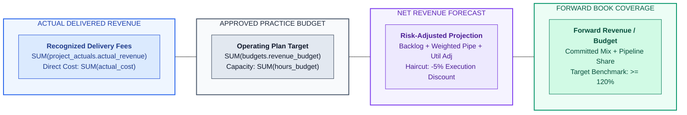
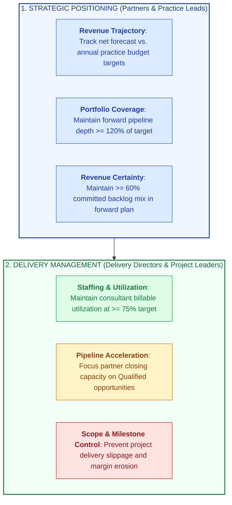
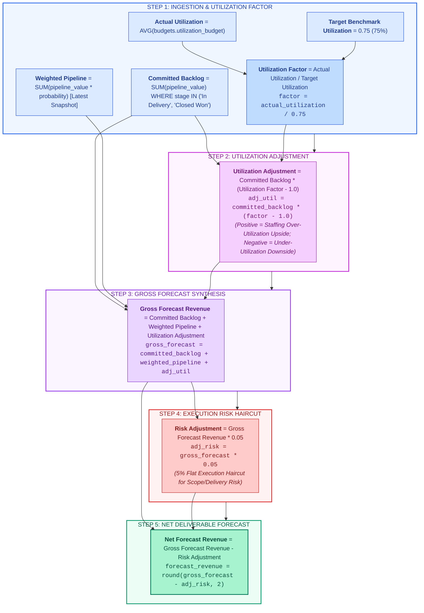
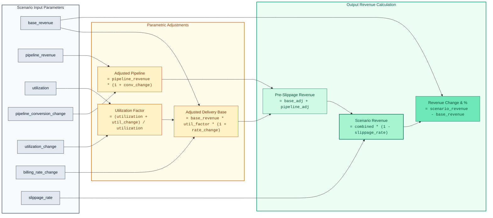

# X-Fin: Enterprise Delivery Finance Operating System

[](https://www.python.org/)
[](https://fastapi.tiangolo.com/)
[](https://www.postgresql.org/)
[](https://streamlit.io/)
[](https://plotly.com/)

---

## Executive Overview: Practice Economics at BCG X

X-Fin is the delivery finance operating platform designed for Managing Directors & Partners (MDPs), Practice Area Leads, and Delivery Directors across **BCG X** business units (**X Build**, **X Design**, and **Digital Ventures**).

It provides real-time transparency across engagement economics, billing realization, billable staffing utilization, project backlog velocity, and probability-weighted pipeline conversion.



---

## Key Levers for Practice Leadership



---

## End-to-End System Architecture

```mermaid
graph TD
    subgraph Presentation["PRESENTATION LAYER (Streamlit :8501)"]
        UI_MAIN["<b>Executive Dashboard (dashboard/app.py)</b><br/>• Executive KPI Summary Banner<br/>• Monthly Revenue Trajectory Time Series (Plotly)<br/>• Backlog Waterfall & Coverage Split (Plotly)<br/>• Business Unit Gross Margins & Utilization (Plotly)<br/>• Scenario Planning Sensitivity Tool"]
        UI_INTEL["<b>Intelligence Deep-Dive (dashboard/intelligence.py)</b><br/>• Strategic Position Assessment Banner<br/>• Budget vs. Forecast vs. Actual Revenue Outlook (Plotly)<br/>• Committed Backlog vs. Weighted Pipeline Split (Plotly)<br/>• 5-Component Forecast Construction Table<br/>• 9 Diagnostic Insight Cards & 10 Action Item Cards"]
        UI_API["<b>HTTP Interface Connector (dashboard/api.py)</b><br/>• Requests HTTP Client (Base URL: http://127.0.0.1:8000)<br/>• 10s Request Timeout with Structured Error Handling"]

        UI_MAIN & UI_INTEL --> UI_API
    end

    subgraph Gateway["GATEWAY & ROUTER LAYER (FastAPI :8000)"]
        MAIN["app.main:app (FastAPI Application Factory)"]
        R_FC["/forecast/current"]
        R_AN["/analytics/* (/summary, /monthly-revenue, /backlog, /variance, /forecast-accuracy, /business-units)"]
        R_IN["/intelligence/* (/health, /overview)"]
        R_SC["/scenarios/run"]
        R_PR["/projects/*"]

        MAIN --> R_FC & R_AN & R_IN & R_SC & R_PR
    end

    subgraph ServiceLayer["SERVICE & CALCULATION LAYER (app/services)"]
        S1["<b>forecast_engine.py</b>: 5-step deterministic forecast model"]
        S2["<b>backlog_engine.py</b>: Committed vs. uncommitted backlog waterfall"]
        S3["<b>variance_engine.py</b>: Multi-component budget variance bridge"]
        S4["<b>finance_reasoning.py</b>: 20+ derived practice metrics & classifications"]
        S5["<b>insight_engine.py</b>: 9 diagnostic severity evaluators"]
        S6["<b>recommendation_engine.py</b>: 10 prioritized operational remediation rules"]
        S7["<b>scenario_engine.py</b>: What-if sensitivity simulator (conversion, rate, util, slippage)"]
        S8["<b>business_unit_engine.py</b>: Practice-level revenue, margin, and hours aggregation"]
        S9["<b>forecast_accuracy.py</b>: Historical monthly actual vs budget accuracy series"]
        S10["<b>finance_queries.py</b>: Optimized raw SQL select queries"]
    end

    subgraph Storage["DATABASE LAYER (PostgreSQL 14+)"]
        T1[("<b>business_units</b>: X Build, X Design, Digital Ventures")]
        T2[("<b>projects</b>: Engagement metadata, stage, billing rates, planned hours")]
        T3[("<b>project_pipeline</b>: Point-in-time stage snapshots and win probabilities")]
        T4[("<b>project_actuals</b>: Monthly delivered hours, recognized fees, direct costs")]
        T5[("<b>budgets</b>: Monthly revenue targets, capacity budgets, target utilization")]
        T6[("<b>forecast_versions</b>: Forecast snapshot metadata")]
        T7[("<b>forecast_values</b>: Project-level forecast attribution")]
    end

    UI_API -->|HTTP REST JSON| Gateway
    Gateway --> ServiceLayer
    ServiceLayer -->|SQLAlchemy Raw Queries| Storage

    style Presentation fill:#EFF6FF,stroke:#2563EB,stroke-width:2px,color:#1E40AF
    style Gateway fill:#F0FDF4,stroke:#16A34A,stroke-width:2px,color:#15803D
    style ServiceLayer fill:#FAF5FF,stroke:#9333EA,stroke-width:2px,color:#6B21A8
    style Storage fill:#F8FAFC,stroke:#475569,stroke-width:2px,color:#1E293B

    style UI_MAIN fill:#DBEAFE,stroke:#1E40AF,stroke-width:1px,color:#1E3A8A
    style UI_INTEL fill:#DBEAFE,stroke:#1E40AF,stroke-width:1px,color:#1E3A8A
    style UI_API fill:#E2E8F0,stroke:#334155,stroke-width:1px,color:#0F172A

    style MAIN fill:#DCFCE7,stroke:#15803D,stroke-width:1px,color:#166534
    style R_FC fill:#DCFCE7,stroke:#15803D,stroke-width:1px,color:#166534
    style R_AN fill:#DCFCE7,stroke:#15803D,stroke-width:1px,color:#166534
    style R_IN fill:#DCFCE7,stroke:#15803D,stroke-width:1px,color:#166534
    style R_SC fill:#DCFCE7,stroke:#15803D,stroke-width:1px,color:#166534
    style R_PR fill:#DCFCE7,stroke:#15803D,stroke-width:1px,color:#166534

    style S1 fill:#F3E8FF,stroke:#7E22CE,stroke-width:1px,color:#581C87
    style S2 fill:#F3E8FF,stroke:#7E22CE,stroke-width:1px,color:#581C87
    style S3 fill:#F3E8FF,stroke:#7E22CE,stroke-width:1px,color:#581C87
    style S4 fill:#F3E8FF,stroke:#7E22CE,stroke-width:1px,color:#581C87
    style S5 fill:#F3E8FF,stroke:#7E22CE,stroke-width:1px,color:#581C87
    style S6 fill:#F3E8FF,stroke:#7E22CE,stroke-width:1px,color:#581C87
    style S7 fill:#F3E8FF,stroke:#7E22CE,stroke-width:1px,color:#581C87
    style S8 fill:#F3E8FF,stroke:#7E22CE,stroke-width:1px,color:#581C87
    style S9 fill:#F3E8FF,stroke:#7E22CE,stroke-width:1px,color:#581C87
    style S10 fill:#F3E8FF,stroke:#7E22CE,stroke-width:1px,color:#581C87

    style T1 fill:#E2E8F0,stroke:#475569,stroke-width:1px,color:#1E293B
    style T2 fill:#E2E8F0,stroke:#475569,stroke-width:1px,color:#1E293B
    style T3 fill:#E2E8F0,stroke:#475569,stroke-width:1px,color:#1E293B
    style T4 fill:#E2E8F0,stroke:#475569,stroke-width:1px,color:#1E293B
    style T5 fill:#E2E8F0,stroke:#475569,stroke-width:1px,color:#1E293B
    style T6 fill:#E2E8F0,stroke:#475569,stroke-width:1px,color:#1E293B
    style T7 fill:#E2E8F0,stroke:#475569,stroke-width:1px,color:#1E293B
```



---

## Forecast Engine Mathematical Specification

The forecast engine (`app/services/forecast_engine.py`) calculates the net projected period revenue through a deterministic 5-step formulation:



### Numerical Trace Verification

| Calculation Step | Parameter Name | Baseline Input | Mathematical Operation | Computed Value |
|:-----------------|:---------------|:---------------|:-----------------------|:---------------|
| **1. Backlog Ingestion** | `committed_backlog` | INR 100,000.00 | Signed/In-Delivery Deals | INR 100,000.00 |
| **2. Pipeline Weighting**| `weighted_pipeline` | INR 50,000.00 | Sum of `value * prob` | INR 50,000.00 |
| **3. Utilization Delta** | `utilization_adj` | 75% vs 75% Target | `100,000 * (1.00 - 1.0)`| INR 0.00 |
| **4. Gross Synthesis** | `gross_forecast` | Combined Components | `100,000 + 50,000 + 0` | INR 150,000.00 |
| **5. Risk Haircut** | `risk_adjustment` | 5% Execution Rate | `150,000 * 0.05` | INR 7,500.00 |
| **6. Net Deliverable** | **`forecast_revenue`** | Net Output | **`150,000 - 7,500`** | **INR 142,500.00** |

> **Automated Verification:** Verified by `pytest tests/test_forecast.py`.

---

## Intelligence Subsystem Architecture

```mermaid
flowchart TD
    subgraph Telemetry["PRACTICE FINANCIAL TELEMETRY"]
        D1["actual_revenue"]
        D2["budget_revenue"]
        D3["forecast_revenue"]
        D4["committed_backlog"]
        D5["weighted_pipeline"]
    end

    subgraph Stage1["STAGE 1: FINANCE REASONING (finance_reasoning.py)"]
        direction TB
        R1["<b>Calculate Variances & Trajectories:</b><br/>• budget_gap = actual_revenue - budget_revenue<br/>• budget_gap_pct = (budget_gap / budget_revenue) * 100<br/>• forecast_gap = forecast_revenue - budget_revenue<br/>• forecast_gap_pct = (forecast_gap / budget_revenue) * 100"]
        R2["<b>Calculate Coverage & Revenue Mix:</b><br/>• forward_revenue = committed_backlog + weighted_pipeline<br/>• forward_coverage = (forward_revenue / budget_revenue) * 100<br/>• committed_forecast_coverage = (committed_backlog / forecast_revenue) * 100<br/>• pipeline_dependency = (weighted_pipeline / forward_revenue) * 100<br/>• committed_revenue_mix = (committed_backlog / forward_revenue) * 100"]
        R3["<b>Classify Operational Risk Profiles:</b><br/>• forecast_risk: 'low' (>=70%), 'moderate' (50-69%), 'high' (<50%)<br/>• pipeline_risk: 'low' (<=30%), 'moderate' (31-50%), 'high' (>50%)<br/>• forward_position: 'strong' (>=120%), 'adequate' (100-119%), 'watch' (80-99%), 'weak' (<80%)<br/>• performance: 'ahead_of_plan' (>0), 'below_plan' (<0), 'on_plan' (==0)<br/>• forecast_status: 'on_or_above_plan' (>0), 'below_plan' (<0), 'on_plan' (==0)"]
        R1 --> R2 --> R3
    end

    subgraph Stage2["STAGE 2: INSIGHT GENERATION (insight_engine.py)"]
        direction TB
        I_MAP["Evaluate 9 Heuristic Severity Rules across Performance, Coverage, Quality, and Risk Dimensions"]
        I_RES["<b>Scored Insights List:</b><br/>Array of objects with severity ('HIGH'|'MEDIUM'|'LOW'), category, metric, message, and value"]
        I_MAP --> I_RES
    end

    subgraph Stage3["STAGE 3: ACTION RECOMMENDATIONS (recommendation_engine.py)"]
        direction TB
        REC_MAP["Evaluate 10 Decision Action Rules mapping operational deficits to prescriptive interventions"]
        REC_RES["<b>Priority-Sorted Recommendations:</b><br/>Array of action objects with priority ('HIGH'|'MEDIUM'|'LOW'), action, rationale, and quantified INR impact"]
        REC_MAP --> REC_RES
    end

    Telemetry --> Stage1 --> Stage2 --> Stage3

    style Telemetry fill:#F8FAFC,stroke:#475569,stroke-width:2px,color:#1E293B
    style Stage1 fill:#EFF6FF,stroke:#2563EB,stroke-width:2px,color:#1E40AF
    style Stage2 fill:#FFFBEB,stroke:#D97706,stroke-width:2px,color:#92400E
    style Stage3 fill:#ECFDF5,stroke:#059669,stroke-width:2px,color:#065F46

    style D1 fill:#E2E8F0,stroke:#334155,stroke-width:1px,color:#0F172A
    style D2 fill:#E2E8F0,stroke:#334155,stroke-width:1px,color:#0F172A
    style D3 fill:#E2E8F0,stroke:#334155,stroke-width:1px,color:#0F172A
    style D4 fill:#E2E8F0,stroke:#334155,stroke-width:1px,color:#0F172A
    style D5 fill:#E2E8F0,stroke:#334155,stroke-width:1px,color:#0F172A

    style R1 fill:#DBEAFE,stroke:#1D4ED8,stroke-width:1px,color:#1E3A8A
    style R2 fill:#DBEAFE,stroke:#1D4ED8,stroke-width:1px,color:#1E3A8A
    style R3 fill:#DBEAFE,stroke:#1D4ED8,stroke-width:1px,color:#1E3A8A

    style I_MAP fill:#FEF3C7,stroke:#B45309,stroke-width:1px,color:#78350F
    style I_RES fill:#FDE68A,stroke:#B45309,stroke-width:1px,color:#78350F

    style REC_MAP fill:#D1FAE5,stroke:#047857,stroke-width:1px,color:#064E3B
    style REC_RES fill:#A7F3D0,stroke:#047857,stroke-width:1px,color:#064E3B
```



---

## Practice Lead Diagnostic Matrix (9 Rules)

| # | Diagnostic Dimension | Metric Evaluated | [HIGH] Severity Trigger | [MEDIUM] Severity Trigger | [LOW] Severity Trigger | Management Playbook |
|:--:|:---------------------|:-----------------|:------------------------|:--------------------------|:-----------------------|:--------------------|
| **1** | Revenue Performance | `budget_gap_pct` | `<= -10.0%` | `-10.0% < gap < 0.0%` | `>= 0.0%` | Investigate billable hours recognition across active cases |
| **2** | Forecast Trajectory | `forecast_gap_pct` | `<= -10.0%` | `-10.0% < gap < 0.0%` | `>= 0.0%` | Partner intervention required to accelerate late-stage pipeline |
| **3** | Forward Coverage | `forward_coverage` | `< 100.0%` | `100.0% – 119.9%` | `>= 120.0%` | Originate new proposals in priority client accounts |
| **4** | Forecast Quality | `committed_forecast_coverage` | `< 50.0%` | `50.0% – 69.9%` | `>= 70.0%` | Expedite signature of pending Statements of Work (SOWs) |
| **5** | Pipeline Dependency | `pipeline_dependency` | `>= 60.0%` | `40.0% – 59.9%` | `< 40.0%` | De-risk plan by closing top 3 opportunities |
| **6** | Committed Revenue Mix| `committed_revenue_mix` | `< 40.0%` | `40.0% – 59.9%` | `>= 60.0%` | Harden backlog to ensure staffing certainty |
| **7** | Forecast Risk Profile| `forecast_risk` | `=="high"` | `=="moderate"` | `=="low"` | Implement weekly case milestone health checks |
| **8** | Market Stance | `forward_position` | `in ("watch","weak")` | `=="adequate"` | `=="strong"` | Align practice staffing and hiring to pipeline reality |
| **9** | Headroom Buffer | `forecast_headroom` | `< 0.0` | — | `> 0.0` | Dedicate partner commercial capacity to bridge shortfall |

---

## Action Recommendation Engine (10 Rules)

| Priority | Operational Domain | Activation Condition | Prescriptive Action Item | Quantified Financial Impact |
|:---------|:-------------------|:---------------------|:-------------------------|:----------------------------|
| **[HIGH]** | Revenue Recovery | `budget_gap < 0` | Mobilize partner-led revenue recovery plan on lagging accounts | `abs(budget_gap)` |
| **[HIGH]** | Forecast Protection | `forecast_gap < 0` | Lock in pending contract extensions and prevent scope reduction | `abs(forecast_gap)` |
| **[HIGH]** | Pipeline Coverage | `forward_coverage < 100%` | Fast-track high-probability proposals to achieve baseline budget | `budget_revenue - forward_revenue` |
| **[MEDIUM]** | Coverage Buffer | `100% <= forward_coverage < 120%` | Maintain business development momentum to preserve safety buffer | `forward_revenue - budget_revenue` |
| **[HIGH]** | Deal Closure Surge | `pipeline_dependency >= 60%` | Conduct executive closing sessions on all deals in Qualified stage | `weighted_pipeline` |
| **[MEDIUM]** | Velocity Management | `40% <= pipeline_dependency < 60%` | Review stage-gate progression weekly with client teams | `weighted_pipeline` |
| **[HIGH]** | Backlog Fortification| `committed_forecast_coverage < 50%` | Prioritize execution of MSAs and SOWs currently under legal review | `forecast_revenue - committed_backlog` |
| **[MEDIUM]** | Backlog Hardening | `50% <= committed_forecast_coverage < 70%` | Expedite client sign-offs on milestone deliverables | `forecast_revenue - committed_backlog` |
| **[HIGH]** | Delivery Audit | `forecast_risk == "high"` | Conduct portfolio-wide review to prevent deliverable slippage | `forecast_revenue` |
| **[LOW]** | Margin Optimization | `forward_coverage >= 120%` & `pipeline < 60%` | Prioritize higher-margin, premium-rate engagements | `forecast_gap` |

---

## Engagement Lifecycle & Backlog Transition Model

```mermaid
stateDiagram-v2
    [*] --> Prospect : Win Probability = 15%
    Prospect --> Qualified : Win Probability = 35%
    Qualified --> In_Delivery : Win Probability = 75%
    Qualified --> Closed_Lost : Win Probability = 0%
    In_Delivery --> Closed_Won : Win Probability = 100%
    In_Delivery --> Closed_Lost : Win Probability = 0%

    note right of Prospect
        <b>UNCOMMITTED PIPELINE</b>
        • Stage: Prospect
        • Backlog Class: Uncommitted (15%)
    end note

    note right of Qualified
        <b>UNCOMMITTED PIPELINE</b>
        • Stage: Qualified
        • Backlog Class: Uncommitted (35%)
    end note

    note right of In_Delivery
        <b>COMMITTED BACKLOG</b>
        • Stage: In Delivery
        • Backlog Class: Committed (75%)
    end note

    note right of Closed_Won
        <b>COMMITTED BACKLOG</b>
        • Stage: Closed Won
        • Backlog Class: Committed (100%)
    end note
```



---

## Complete API Route Specifications

| Method | Endpoint Path | Return Schema | Function / Module | Operational Description |
|:------:|:--------------|:--------------|:------------------|:------------------------|
| `GET` | `/` | `ServiceInfo` | `app.main` | Application name, version, status, description |
| `GET` | `/health` | `HealthStatus` | `app.main` | System health check probe |
| `GET` | `/forecast/current` | `ForecastResponse` | `forecast_engine.build_forecast()` | Current period forecast, pipeline & backlog summary |
| `GET` | `/analytics/summary` | `FinanceSummary` | `finance_queries.get_finance_summary()` | Aggregated actuals, budgets, and backlog summary |
| `GET` | `/analytics/monthly-revenue` | `List[MonthlyRevenue]` | `finance_queries.get_monthly_revenue()` | Historical monthly recognized revenue, hours, cost |
| `GET` | `/analytics/backlog` | `BacklogResponse` | `backlog_engine.calculate_backlog()` | Committed vs uncommitted backlog and waterfall |
| `GET` | `/analytics/variance` | `VarianceResult` | `variance_engine.calculate_variance()` | Absolute and % actual vs budget and forecast vs budget |
| `GET` | `/analytics/forecast-accuracy`| `List[AccuracyItem]` | `forecast_accuracy.get_forecast_accuracy()` | Month-by-month historical forecast accuracy |
| `GET` | `/analytics/business-units` | `List[BUPerformance]` | `business_unit_engine.get_bu_performance()` | Practice-level revenue, margin, and hours breakdown |
| `GET` | `/intelligence/health` | `HealthStatus` | `routers.intelligence` | Intelligence subsystem health check |
| `GET` | `/intelligence/overview` | `IntelligencePackage` | `routers.intelligence` | Full reasoning metrics, insights, recommendations |
| `POST` | `/scenarios/run` | `ScenarioResult` | `scenario_engine.run_scenario()` | Multi-parameter what-if revenue simulation |

---

## Scenario Simulation Engine

`app/services/scenario_engine.py` models the revenue impact of commercial and operational shocks:



---

## Local Development & Operations

### 1. Virtual Environment Setup

```bash
cd x-fin
python -m venv .venv
# On Windows:
.venv\Scripts\activate
# On Linux/macOS:
source .venv/bin/activate

pip install -r requirements.txt
```

### 2. Database Initialization

```bash
# Apply PostgreSQL schema
psql -U postgres -d consulting_forecast -f app/db/schema.sql

# Generate synthetic practice data (750 projects, 24 months)
python scripts/generate_synthetic_data.py
python scripts/load_data.py
```

### 3. Service Execution

```bash
# Terminal 1: Start FastAPI Service
uvicorn app.main:app --reload --port 8000

# Terminal 2: Start Executive Dashboard
cd dashboard
streamlit run app.py
```

### 4. Automated Testing

```bash
pytest tests/ -v
```

---

## Technical Documentation Directory

| Document Path | Description |
|:--------------|:------------|
| [docs/ARCHITECTURE.md](docs/ARCHITECTURE.md) | Component architecture, deployment topology, and data flow pipelines |
| [docs/API.md](docs/API.md) | REST API endpoints, JSON schemas, payload examples, and status codes |
| [docs/DATA_MODEL.md](docs/DATA_MODEL.md) | PostgreSQL relational schema, column definitions, constraints, and ERD |
| [docs/FORECAST_ENGINE.md](docs/FORECAST_ENGINE.md) | Mathematical formulation, parameter sensitivities, and haircut rules |
| [docs/INTELLIGENCE.md](docs/INTELLIGENCE.md) | Reasoning specifications, 9 insight evaluators, and 10 action triggers |
| [docs/DEVELOPMENT.md](docs/DEVELOPMENT.md) | Setup walkthrough, test suite executions, conventions, and dependencies |

---

## License & Compliance

Internal Delivery Finance Platform · BCG X · Confidential & Proprietary
