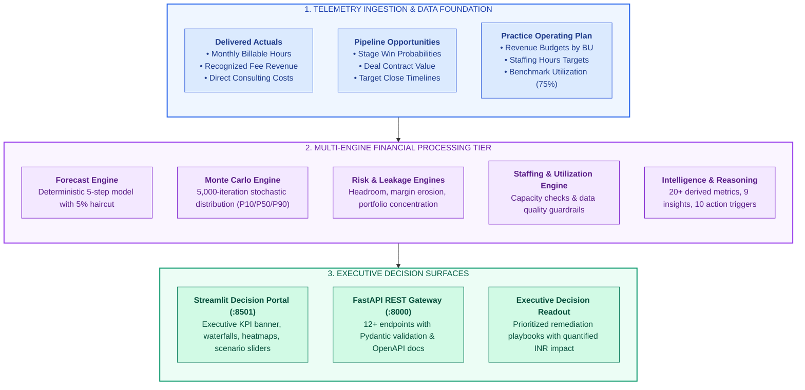
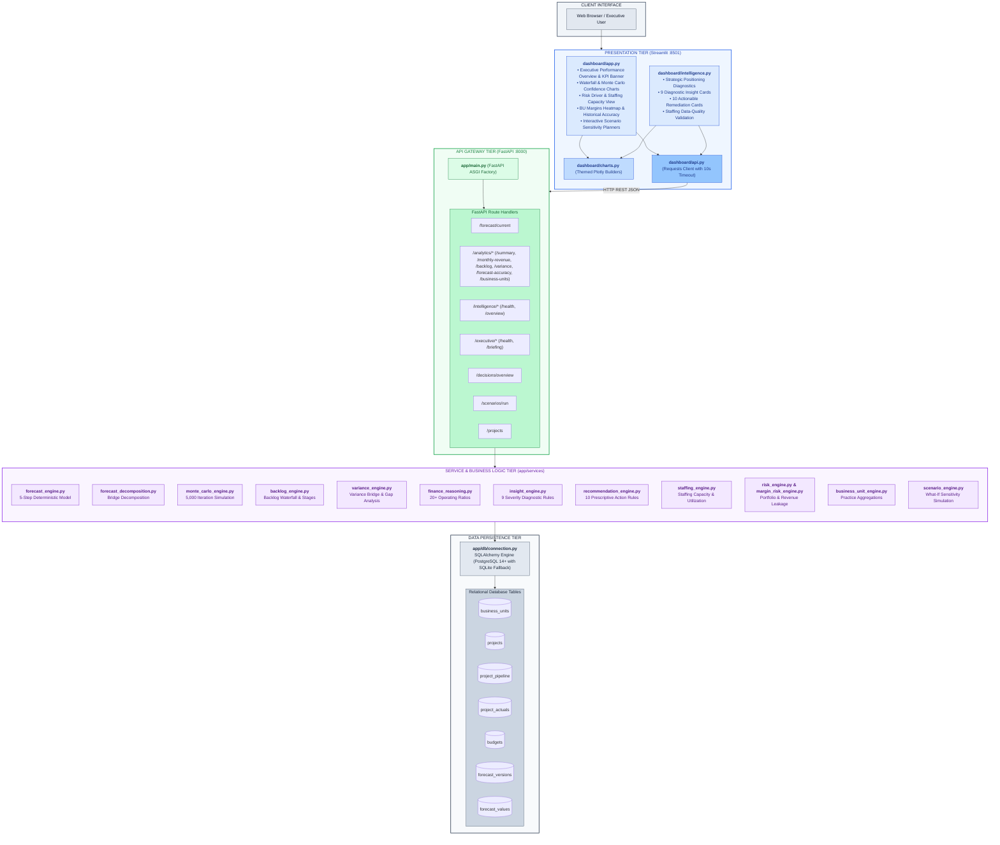
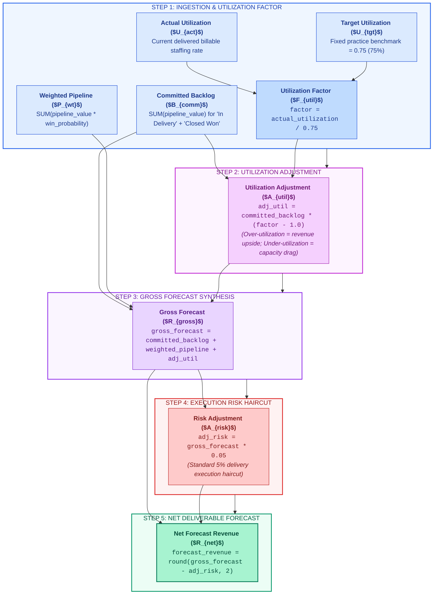
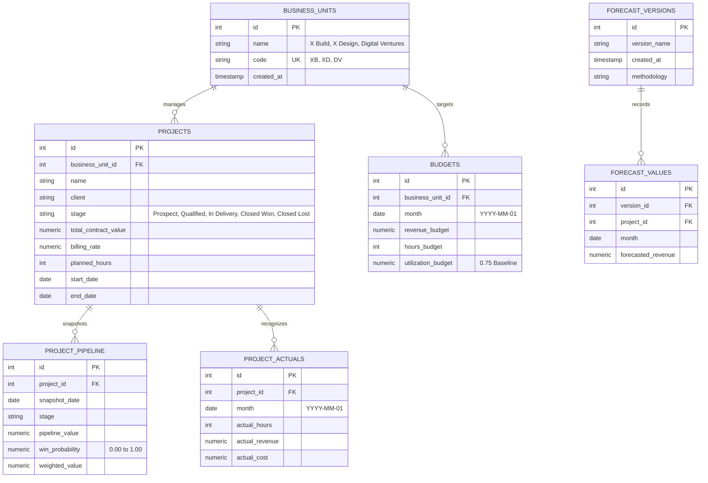
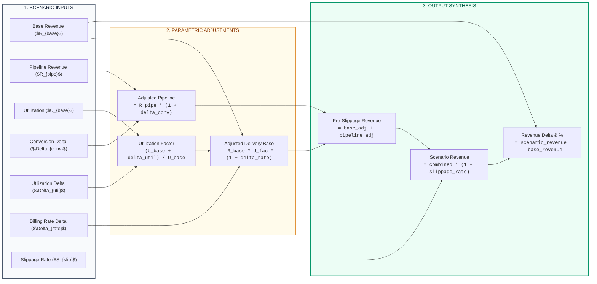

# X-Fin: Enterprise Delivery Finance Operating System

---

## Executive Summary & System Overview

**X-Fin** is an enterprise-grade delivery finance operating system engineered as a functional portfolio showcase modeled on modern technology consulting delivery practices (such as **X Build**, **X Design**, and **Digital Ventures**). 

The platform automates the synthesis of commercial pipeline telemetry, contracted project backlogs, consultant staffing hours, and financial actuals into real-time, risk-adjusted revenue forecasts and executive decision intelligence.

---

## Core Financial Pillars & Executive KPI Definitions

| Pillar | Metric Name | Mathematical Definition | Target Benchmark | Strategic & Operating Purpose |
|:-------|:------------|:------------------------|:----------------:|:------------------------------|
| **Revenue** | **Actual Revenue** | $\sum \text{project\_actuals.actual\_revenue}$ | $\ge \text{Budget Target}$ | Recognized delivery fees to date across billing cycles |
| **Revenue** | **Revenue Budget** | $\sum \text{budgets.revenue\_budget}$ | Plan Baseline | Approved annual/quarterly operating plan revenue target |
| **Forecast** | **Net Forecast Revenue** | $\text{Gross Forecast} \times (1 - 0.05)$ | $\ge \text{Budget Target}$ | Primary deliverable forecast after 5% execution risk haircut |
| **Forecast** | **Forecast Headroom** | $\text{Net Forecast} - \text{Budget Target}$ | $> 0$ (Surplus) | Absolute buffer above baseline plan (negative = budget deficit) |
| **Coverage** | **Forward Coverage** | $\frac{\text{Backlog}_{\text{committed}} + \text{Pipeline}_{\text{weighted}}}{\text{Budget}} \times 100$ | $\ge 120.0\%$ | Total forward book depth supporting target attainment |
| **Quality** | **Committed Revenue Mix** | $\frac{\text{Backlog}_{\text{committed}}}{\text{Forward Revenue}} \times 100$ | $\ge 60.0\%$ | Share of forward plan secured by executed SOWs/contracts |
| **Risk** | **Pipeline Dependency** | $\frac{\text{Pipeline}_{\text{weighted}}}{\text{Forward Revenue}} \times 100$ | $\le 40.0\%$ | Vulnerability of forward plan to commercial conversion slippage |
| **Staffing** | **Consultant Utilization** | $\frac{\text{Billable Delivered Hours}}{\text{Available Capacity Hours}} \times 100$ | $75.0\%$ Baseline | Billable staffing efficiency vs target operational capacity |
| **Stochastic**| **P50 Expected Value** | 50th Percentile of 5,000 Monte Carlo Iterations | $\approx \text{Net Forecast}$ | Median probabilistic outcome under stochastic volatility |
| **Stochastic**| **Value-at-Risk (VaR P10)** | $\text{Deterministic Forecast} - \text{P10 Outcome}$ | Minimize | Quantified downside revenue exposure under adverse market conditions |

---

## End-to-End System Architecture

---

## Deterministic Forecast Engine (5-Step Formulation)

The forecast engine (`app/services/forecast_engine.py`) models delivery revenue deterministically through a 5-step formulation:

### Deterministic Calculation Trace Matrix

| Step | Engine Component | Mathematical Equation | Sample Input Value | Resulting Output Value |
|:----:|:-----------------|:----------------------|:-------------------|:----------------------|
| **1** | Committed Backlog | $\sum \text{Value}_{\text{Signed/In-Delivery}}$ | Baseline Ingestion | INR 100,000.00 |
| **2** | Weighted Pipeline | $\sum (\text{Value} \times \text{Prob})$ | Baseline Ingestion | INR 50,000.00 |
| **3** | Utilization Adjustment | $\text{Backlog} \times \left(\frac{U_{\text{act}}}{0.75} - 1.0\right)$ | $U_{\text{act}} = 75.0\%$ | INR 0.00 |
| **4** | Gross Forecast | $\text{Backlog} + \text{Pipeline} + \text{Adj}_{\text{util}}$ | $100,000 + 50,000 + 0$ | INR 150,000.00 |
| **5** | Execution Haircut (5%) | $\text{Gross Forecast} \times 0.05$ | $150,000 \times 0.05$ | INR -7,500.00 |
| **6** | **Net Deliverable Forecast** | $\mathbf{\text{Gross Forecast} - \text{Haircut}}$ | **$150,000 - 7,500$** | **INR 142,500.00** |

---

## Monte Carlo Stochastic Simulation Engine

In addition to deterministic calculations, `app/services/monte_carlo_engine.py` executes a **5,000-iteration Monte Carlo simulation** to quantify uncertainty across pipeline conversion, utilization variance, and deliverable slippage:

```mermaid
flowchart LR
    subgraph PARAMS["Stochastic Distributions"]
        P_CONV["<b>Pipeline Conversion</b><br/>Beta Distribution<br/>Mean = Win Prob"]
        P_UTIL["<b>Utilization Shock</b><br/>Normal Distribution<br/>$\mu = 0, \sigma = 0.04$"]
        P_SLIP["<b>Delivery Slippage</b><br/>Log-Normal Distribution<br/>Range: 0% to 15%"]
    end

    subgraph SIM["5,000 Iteration Loop (Seed = 42)"]
        S_ITER["Generate 5,000 synthetic outcomes for gross revenue, haircuts, and net revenue"]
    end

    subgraph METRICS["Quantile Outputs & VaR"]
        Q10["<b>P10 (Downside)</b><br/>Conservative 90% confidence lower bound"]
        Q50["<b>P50 (Median)</b><br/>Stochastic expected baseline"]
        Q90["<b>P90 (Upside)</b><br/>Optimistic conversion trajectory"]
        VAR["<b>Value-at-Risk (VaR)</b><br/>$\text{Deterministic} - \text{P10}$"]
    end

    PARAMS --> SIM --> METRICS

    style PARAMS fill:#EFF6FF,stroke:#2563EB,stroke-width:2px,color:#1E40AF
    style SIM fill:#FAF5FF,stroke:#9333EA,stroke-width:2px,color:#6B21A8
    style METRICS fill:#ECFDF5,stroke:#059669,stroke-width:2px,color:#065F46

    style P_CONV fill:#DBEAFE,stroke:#1D4ED8,stroke-width:1px,color:#1E3A8A
    style P_UTIL fill:#DBEAFE,stroke:#1D4ED8,stroke-width:1px,color:#1E3A8A
    style P_SLIP fill:#DBEAFE,stroke:#1D4ED8,stroke-width:1px,color:#1E3A8A

    style S_ITER fill:#F3E8FF,stroke:#7E22CE,stroke-width:1px,color:#581C87

    style Q10 fill:#FEE2E2,stroke:#DC2626,stroke-width:1px,color:#991B1B
    style Q50 fill:#DBEAFE,stroke:#1D4ED8,stroke-width:1px,color:#1E3A8A
    style Q90 fill:#DCFCE7,stroke:#15803D,stroke-width:1px,color:#166534
    style VAR fill:#FEF3C7,stroke:#D97706,stroke-width:1px,color:#92400E
```

### Monte Carlo Confidence Band Interpretation

| Quantile Metric | Statistical Confidence | Strategic Interpretation | Leadership Decision Trigger |
|:----------------|:----------------------:|:-------------------------|:----------------------------|
| **P10 (Downside)** | $90\%$ Confidence Lower Bound | Minimum revenue expected even if deals slip and utilization softens | Establish baseline cost controls & staffing floor |
| **P50 (Median)** | $50\%$ Percentile Outcome | Central tendency of stochastic revenue realization | Primary comparison point for deterministic forecast |
| **P90 (Upside)** | $10\%$ Probability Exceedance | High-conversion scenario where major proposals close early | Reserve commercial bandwidth and contractor pool |
| **Confidence Band Width** | $(P90 - P10) / P50$ | Measurement of practice revenue volatility and uncertainty | $> 25\%$ implies elevated forward forecast instability |

---

## Intelligence & Financial Reasoning Engine

`app/services/finance_reasoning.py` and `app/services/intelligence_engine.py` derive 20+ financial telemetry indicators to classify practice health:

```mermaid
flowchart TD
    subgraph IN["FINANCIAL TELEMETRY"]
        T1["actual_revenue"]
        T2["budget_revenue"]
        T3["forecast_revenue"]
        T4["committed_backlog"]
        T5["weighted_pipeline"]
    end

    subgraph R1["1. VARIANCE & TRAJECTORY"]
        V1["<b>budget_gap</b> = actual_revenue - budget_revenue"]
        V2["<b>budget_gap_pct</b> = (budget_gap / budget_revenue) * 100"]
        V3["<b>forecast_gap</b> = forecast_revenue - budget_revenue"]
        V4["<b>forecast_gap_pct</b> = (forecast_gap / budget_revenue) * 100"]
    end

    subgraph R2["2. COVERAGE & REVENUE COMPOSITION"]
        C1["<b>forward_revenue</b> = committed_backlog + weighted_pipeline"]
        C2["<b>forward_coverage</b> = (forward_revenue / budget_revenue) * 100"]
        C3["<b>committed_forecast_coverage</b> = (committed_backlog / forecast_revenue) * 100"]
        C4["<b>committed_revenue_mix</b> = (committed_backlog / forward_revenue) * 100"]
        C5["<b>pipeline_dependency</b> = (weighted_pipeline / forward_revenue) * 100"]
    end

    subgraph R3["3. HEALTH CLASSIFICATION ENGINE"]
        H1["<b>forecast_risk</b>: 'low' (>=70%), 'moderate' (50-69%), 'high' (<50%)"]
        H2["<b>pipeline_risk</b>: 'low' (<=30%), 'moderate' (31-50%), 'high' (>50%)"]
        H3["<b>forward_position</b>: 'strong' (>=120%), 'adequate' (100-119%), 'watch' (80-99%), 'weak' (<80%)"]
        H4["<b>headroom_status</b>: 'strong' (>=10%), 'moderate' (0-9.9%), 'deficit' (<0%)"]
    end

    IN --> R1 --> R2 --> R3

    style IN fill:#F8FAFC,stroke:#475569,stroke-width:2px,color:#1E293B
    style R1 fill:#EFF6FF,stroke:#2563EB,stroke-width:2px,color:#1E40AF
    style R2 fill:#FAF5FF,stroke:#9333EA,stroke-width:2px,color:#6B21A8
    style R3 fill:#ECFDF5,stroke:#059669,stroke-width:2px,color:#065F46

    style T1 fill:#E2E8F0,stroke:#334155,stroke-width:1px,color:#0F172A
    style T2 fill:#E2E8F0,stroke:#334155,stroke-width:1px,color:#0F172A
    style T3 fill:#E2E8F0,stroke:#334155,stroke-width:1px,color:#0F172A
    style T4 fill:#E2E8F0,stroke:#334155,stroke-width:1px,color:#0F172A
    style T5 fill:#E2E8F0,stroke:#334155,stroke-width:1px,color:#0F172A

    style V1 fill:#DBEAFE,stroke:#1D4ED8,stroke-width:1px,color:#1E3A8A
    style V2 fill:#DBEAFE,stroke:#1D4ED8,stroke-width:1px,color:#1E3A8A
    style V3 fill:#DBEAFE,stroke:#1D4ED8,stroke-width:1px,color:#1E3A8A
    style V4 fill:#DBEAFE,stroke:#1D4ED8,stroke-width:1px,color:#1E3A8A

    style C1 fill:#F3E8FF,stroke:#7E22CE,stroke-width:1px,color:#581C87
    style C2 fill:#F3E8FF,stroke:#7E22CE,stroke-width:1px,color:#581C87
    style C3 fill:#F3E8FF,stroke:#7E22CE,stroke-width:1px,color:#581C87
    style C4 fill:#F3E8FF,stroke:#7E22CE,stroke-width:1px,color:#581C87
    style C5 fill:#F3E8FF,stroke:#7E22CE,stroke-width:1px,color:#581C87

    style H1 fill:#D1FAE5,stroke:#047857,stroke-width:1px,color:#064E3B
    style H2 fill:#D1FAE5,stroke:#047857,stroke-width:1px,color:#064E3B
    style H3 fill:#D1FAE5,stroke:#047857,stroke-width:1px,color:#064E3B
    style H4 fill:#D1FAE5,stroke:#047857,stroke-width:1px,color:#064E3B
```

---

## Practice Lead Diagnostic Matrix (9 Evaluators)

`app/services/insight_engine.py` evaluates 9 heuristic severity rules to surface operational vulnerabilities:

| # | Diagnostic Dimension | Telemetry Metric | [HIGH] Severity Condition | [MEDIUM] Severity Condition | [LOW] Severity Condition | Management Action |
|:--:|:---------------------|:-----------------|:--------------------------|:----------------------------|:-------------------------|:------------------|
| **1** | Revenue Performance | `budget_gap_pct` | $\le -10.0\%$ | $-10.0\% < \text{gap} < 0.0\%$ | $\ge 0.0\%$ | Audit billable hours recognition & scope creep on active cases |
| **2** | Forecast Trajectory | `forecast_gap_pct` | $\le -10.0\%$ | $-10.0\% < \text{gap} < 0.0\%$ | $\ge 0.0\%$ | Mobilize partner commercial bandwidth to accelerate deals |
| **3** | Forward Coverage | `forward_coverage` | $< 100.0\%$ | $100.0\% \le \text{cov} < 120.0\%$ | $\ge 120.0\%$ | Originate new proposals in tier-1 client accounts |
| **4** | Forecast Quality | `committed_forecast_coverage` | $< 50.0\%$ | $50.0\% \le \text{cov} < 70.0\%$ | $\ge 70.0\%$ | Expedite client execution of pending Statements of Work (SOWs) |
| **5** | Pipeline Dependency | `pipeline_dependency` | $\ge 60.0\%$ | $40.0\% \le \text{dep} < 60.0\%$ | $< 40.0\%$ | Mitigate risk by securing firm commitments on top 3 opportunities |
| **6** | Committed Revenue Mix| `committed_revenue_mix` | $< 40.0\%$ | $40.0\% \le \text{mix} < 60.0\%$ | $\ge 60.0\%$ | Convert verbal client confirmations into binding commitments |
| **7** | Forecast Risk Profile| `forecast_risk` | $== \text{"high"}$ | $== \text{"moderate"}$ | $== \text{"low"}$ | Institute weekly milestone health checks with delivery leads |
| **8** | Market Stance | `forward_position` | $\in \{\text{"watch"}, \text{"weak"}\}$ | $== \text{"adequate"}$ | $== \text{"strong"}$ | Align practice hiring and bench models with pipeline demand |
| **9** | Headroom Buffer | `forecast_headroom` | $< 0.0$ | — | $> 0.0$ | Allocate partner commercial capacity to bridge revenue deficit |

---

## Action Recommendation Engine (10 Rules + Staffing Remediations)

`app/services/recommendation_engine.py` converts diagnostic deficits into prioritized operational remediation playbooks:

```mermaid
flowchart TD
    subgraph TRIG["RULE ACTIVATION LAYER"]
        R1["budget_gap < 0"]
        R2["forecast_gap < 0"]
        R3["forward_coverage < 100%"]
        R4["100% <= forward_coverage < 120%"]
        R5["pipeline_dependency >= 60%"]
        R6["40% <= pipeline_dependency < 60%"]
        R7["committed_forecast_coverage < 50%"]
        R8["50% <= committed_forecast_coverage < 70%"]
        R9["forecast_risk == 'high'"]
        R10["forward_coverage >= 120% & pipeline < 60%"]
    end

    subgraph ACT["PRESCRIPTIVE ACTIONS & FINANCIAL IMPACT"]
        A1["<b>[HIGH] Partner Revenue Recovery</b><br/>Impact: abs(budget_gap)"]
        A2["<b>[HIGH] Forecast Protection Plan</b><br/>Impact: abs(forecast_gap)"]
        A3["<b>[HIGH] Fast-Track Proposal Origination</b><br/>Impact: budget - forward_revenue"]
        A4["<b>[MEDIUM] Coverage Buffer Maintenance</b><br/>Impact: forward_revenue - budget"]
        A5["<b>[HIGH] Executive Closing Surge</b><br/>Impact: weighted_pipeline"]
        A6["<b>[MEDIUM] Stage-Gate Velocity Review</b><br/>Impact: weighted_pipeline"]
        A7["<b>[HIGH] MSA & SOW Legal Hardening</b><br/>Impact: forecast - backlog"]
        A8["<b>[MEDIUM] Milestone Deliverable Sign-Off</b><br/>Impact: forecast - backlog"]
        A9["<b>[HIGH] Portfolio Slippage Audit</b><br/>Impact: forecast_revenue"]
        A10["<b>[LOW] Premium Margin Optimization</b><br/>Impact: forecast_gap"]
    end

    R1 --> A1
    R2 --> A2
    R3 --> A3
    R4 --> A4
    R5 --> A5
    R6 --> A6
    R7 --> A7
    R8 --> A8
    R9 --> A9
    R10 --> A10

    style TRIG fill:#EFF6FF,stroke:#2563EB,stroke-width:2px,color:#1E40AF
    style ACT fill:#ECFDF5,stroke:#059669,stroke-width:2px,color:#065F46
```

### Action Recommendation Catalog

| Priority | Strategy Domain | Activation Condition | Prescriptive Action Item | Quantified Financial Impact (INR) |
|:---------|:----------------|:---------------------|:-------------------------|:----------------------------------|
| **[HIGH]** | Revenue Recovery | `budget_gap < 0` | Mobilize partner-led revenue recovery plan on lagging accounts | $\text{abs}(\text{budget\_gap})$ |
| **[HIGH]** | Forecast Protection | `forecast_gap < 0` | Lock in pending contract extensions and prevent scope reduction | $\text{abs}(\text{forecast\_gap})$ |
| **[HIGH]** | Pipeline Coverage | `forward_coverage < 100%` | Fast-track high-probability proposals to achieve baseline budget | $\text{budget} - \text{forward\_revenue}$ |
| **[MEDIUM]** | Coverage Buffer | `100% <= forward_coverage < 120%` | Maintain commercial business development momentum | $\text{forward\_revenue} - \text{budget}$ |
| **[HIGH]** | Deal Closure Surge | `pipeline_dependency >= 60%` | Conduct executive closing sessions on all deals in Qualified stage | $\text{weighted\_pipeline}$ |
| **[MEDIUM]** | Velocity Management| `40% <= pipeline_dependency < 60%` | Review stage-gate progression weekly with client teams | $\text{weighted\_pipeline}$ |
| **[HIGH]** | Backlog Fortification| `committed_forecast_coverage < 50%`| Prioritize execution of MSAs and SOWs under legal review | $\text{forecast} - \text{backlog}$ |
| **[MEDIUM]** | Backlog Hardening | `50% <= committed_forecast_coverage < 70%`| Expedite client milestone deliverable acceptances | $\text{forecast} - \text{backlog}$ |
| **[HIGH]** | Delivery Audit | `forecast_risk == "high"` | Conduct portfolio-wide review to prevent deliverable slippage | $\text{forecast\_revenue}$ |
| **[LOW]** | Margin Optimization| `forward_coverage >= 120%` & `pipeline < 60%`| Prioritize higher-margin, premium-rate engagements | $\text{forecast\_gap}$ |

---

## Engagement Lifecycle & Backlog Transition Model

```mermaid
stateDiagram-v2
    [*] --> Prospect : Win Probability = 15%
    Prospect --> Qualified : Win Probability = 35%
    Qualified --> In_Delivery : Win Probability = 75%
    Qualified --> Closed_Lost : Win Probability = 0%
    In_Delivery --> Closed_Won : Win Probability = 100%
    In_Delivery --> Closed_Lost : Win Probability = 0%

    note right of Prospect
        <b>UNCOMMITTED PIPELINE</b>
        • Stage: Prospect
        • Backlog Category: Uncommitted (15%)
    end note

    note right of Qualified
        <b>UNCOMMITTED PIPELINE</b>
        • Stage: Qualified
        • Backlog Category: Uncommitted (35%)
    end note

    note right of In_Delivery
        <b>COMMITTED BACKLOG</b>
        • Stage: In Delivery
        • Backlog Category: Committed (75%)
    end note

    note right of Closed_Won
        <b>COMMITTED BACKLOG</b>
        • Stage: Closed Won
        • Backlog Category: Committed (100%)
    end note
```

---

## Database Architecture & Relational Schema

---

## Complete API Route Specifications

| HTTP Method | Route Endpoint | Response Schema | Service Module & Function | Purpose & Description |
|:-----------:|:---------------|:----------------|:--------------------------|:----------------------|
| `GET` | `/` | `Dict[str, str]` | `app.main:root` | Service name, version, health status |
| `GET` | `/health` | `HealthStatus` | `app.main:health` | Application health probe |
| `GET` | `/health/db` | `Dict[str, str]` | `app.main:database_health` | Database connection test probe |
| `GET` | `/forecast/current` | `ForecastResponse` | `forecast_engine.build_forecast()` | Current period forecast with backlog & pipeline split |
| `GET` | `/analytics/summary` | `FinanceSummary` | `finance_queries.get_finance_summary()` | Aggregated actuals, budgets, and backlog overview |
| `GET` | `/analytics/monthly-revenue` | `List[MonthlyRevenue]` | `finance_queries.get_monthly_revenue()` | Historical monthly recognized revenue, hours, cost |
| `GET` | `/analytics/backlog` | `BacklogResponse` | `backlog_engine.calculate_backlog()` | Committed vs uncommitted backlog and waterfall |
| `GET` | `/analytics/variance` | `VarianceResult` | `variance_engine.calculate_variance()` | Actual vs budget and forecast vs budget bridges |
| `GET` | `/analytics/forecast-accuracy`| `List[AccuracyItem]` | `forecast_accuracy.get_forecast_accuracy()` | Month-by-month historical forecast accuracy series |
| `GET` | `/analytics/business-units` | `List[BUPerformance]` | `business_unit_engine.get_bu_performance()` | Practice-level revenue, margin, and hours breakdown |
| `GET` | `/intelligence/health` | `HealthStatus` | `routers.intelligence:health` | Intelligence subsystem health check |
| `GET` | `/intelligence/overview` | `IntelligencePackage` | `intelligence_engine.build_intelligence_overview()` | Canonical 360° financial intelligence bundle |
| `GET` | `/executive/briefing` | `Dict[str, Any]` | `executive_briefing_engine.build_executive_briefing()` | Synthesized executive briefing with decision summary |
| `GET` | `/decisions/overview` | `Dict[str, Any]` | `decision_engine.generate_decisions()` | Standardized decision triggers and recommendations |
| `POST` | `/scenarios/run` | `ScenarioResult` | `scenario_engine.run_scenario()` | Multi-variable what-if revenue simulation |
| `GET` | `/projects` | `List[Dict[str, Any]]` | `routers.projects:get_projects` | Project directory with stage and contract metadata |

---

## Scenario Simulation Engine

`app/services/scenario_engine.py` simulates sensitivity to commercial conversion, utilization, billing rates, and delivery slippage:

---

## Comprehensive Documentation Index

| Documentation File | Target Audience | Primary Focus |
|:-------------------|:----------------|:--------------|
| [docs/ARCHITECTURE.md](docs/ARCHITECTURE.md) | Technical Architects & Leads | Component topologies, data pipelines, and architectural design decisions |
| [docs/FORECAST_ENGINE.md](docs/FORECAST_ENGINE.md) | Finance Analysts & Quant Engineers | 5-step deterministic formulas, haircut rules, and Monte Carlo stochastic mechanics |
| [docs/INTELLIGENCE.md](docs/INTELLIGENCE.md) | Engagement Managers & Practice Leads | 20+ financial reasoning metrics, 9 insight evaluators, and 10 action remediation rules |
| [docs/DATA_MODEL.md](docs/DATA_MODEL.md) | Data Engineers & DBAs | PostgreSQL relational schema, constraints, ERD, and table schemas |
| [docs/API.md](docs/API.md) | Integration Engineers | Complete REST API endpoint catalog, JSON payloads, and schemas |
| [docs/DASHBOARD.md](docs/DASHBOARD.md) | Delivery Leaders & Analysts | Streamlit user workflows, executive tabs, charts, and sensitivity controls |
| [docs/METRICS.md](docs/METRICS.md) | Practice Finance Officers | Standard metric glossary, mathematical formulas, and data quality caveats |
| [docs/DEVELOPMENT.md](docs/DEVELOPMENT.md) | Software Engineers | Local developer workflows, pytest executions, and contribution standards |
| [docs/PRODUCTION.md](docs/PRODUCTION.md) | DevOps & SREs | Production hardening, Render deployment, logging, and security |

---

## Project Attribution

Personal Portfolio Project · Delivery Finance Operating System Showcase
