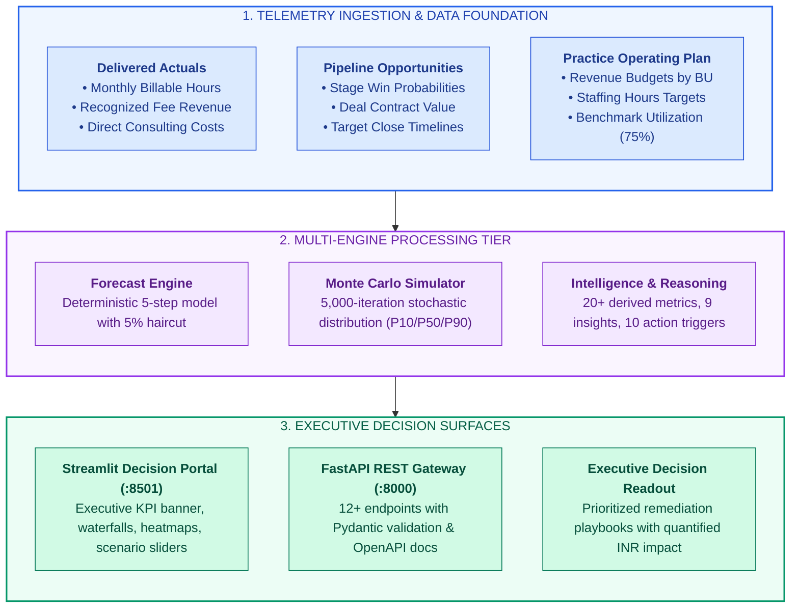
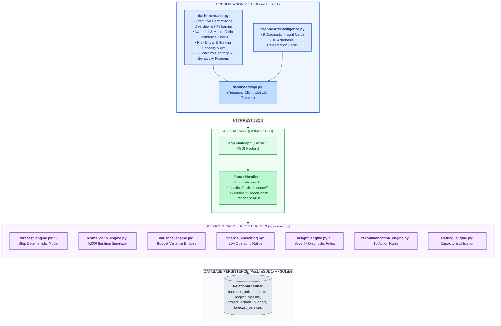
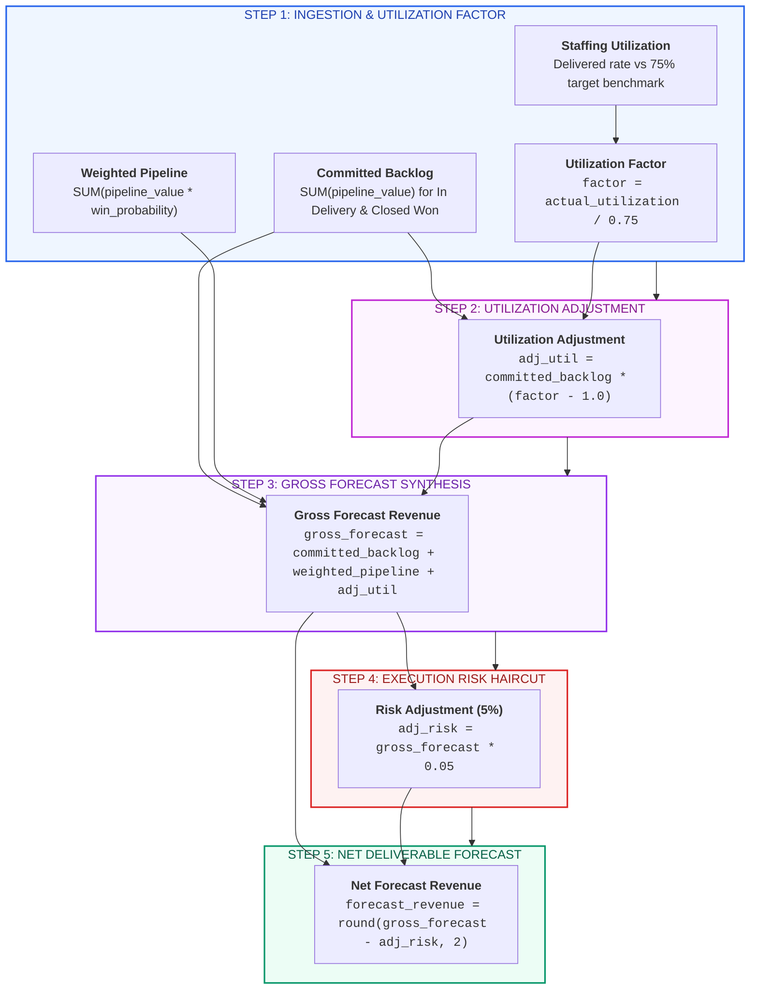
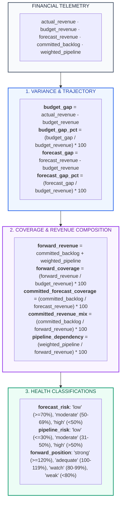
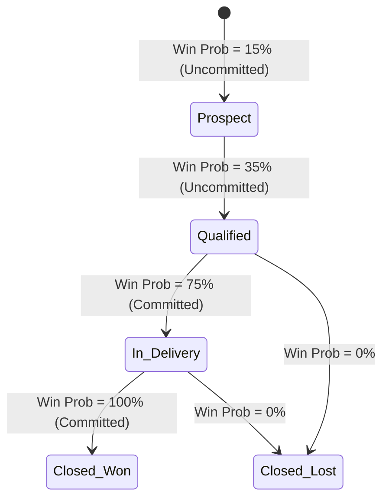
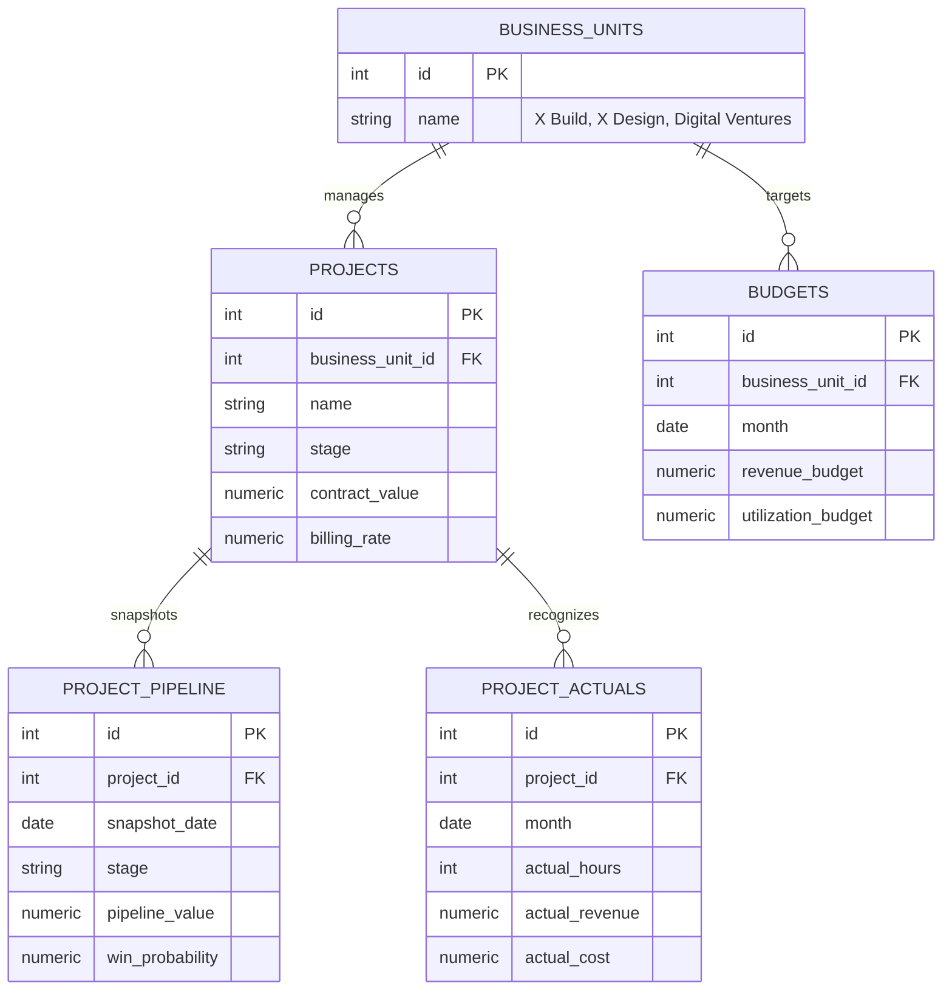
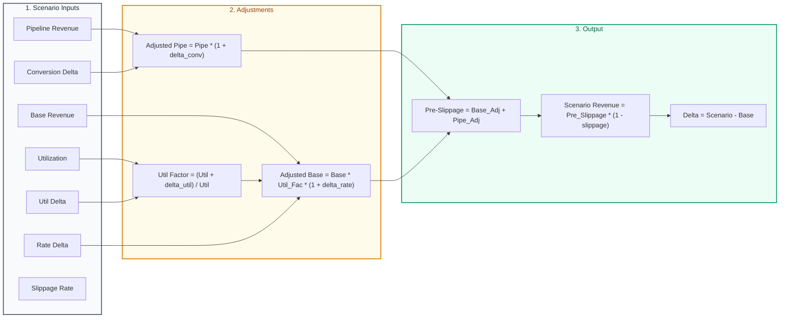

# X-Fin: Enterprise Delivery Finance Operating System

[](https://www.python.org/)
[](https://fastapi.tiangolo.com/)
[](https://www.postgresql.org/)
[](https://www.sqlite.org/)
[](https://streamlit.io/)
[](https://plotly.com/)
[](https://docs.pytest.org/)

---

## Executive Summary & System Overview

**X-Fin** is an enterprise-grade delivery finance operating system engineered as a functional portfolio showcase modeled on modern technology consulting delivery practices (such as **X Build**, **X Design**, and **Digital Ventures**). 

The platform automates the synthesis of commercial pipeline telemetry, contracted project backlogs, consultant staffing hours, and financial actuals into real-time, risk-adjusted revenue forecasts and executive decision intelligence.



---

## Core Financial Pillars & Executive KPI Definitions

| Pillar | Metric Name | Formula / Calculation | Target Benchmark | Strategic & Operating Purpose |
|:-------|:------------|:----------------------|:----------------:|:------------------------------|
| **Revenue** | **Actual Revenue** | `SUM(project_actuals.actual_revenue)` | `>= Budget Target` | Recognized delivery fees to date across billing cycles |
| **Revenue** | **Revenue Budget** | `SUM(budgets.revenue_budget)` | Plan Baseline | Approved annual/quarterly operating plan revenue target |
| **Forecast** | **Net Forecast Revenue** | `Gross Forecast * (1 - 0.05)` | `>= Budget Target` | Primary deliverable forecast after 5% execution risk haircut |
| **Forecast** | **Forecast Headroom** | `Net Forecast - Budget Target` | `> 0` (Surplus) | Absolute buffer above baseline plan (negative = budget deficit) |
| **Coverage** | **Forward Coverage** | `((Backlog + Weighted Pipeline) / Budget) * 100` | `>= 120.0%` | Total forward book depth supporting target attainment |
| **Quality** | **Committed Revenue Mix** | `(Committed Backlog / Forward Revenue) * 100` | `>= 60.0%` | Share of forward plan secured by executed SOWs/contracts |
| **Risk** | **Pipeline Dependency** | `(Weighted Pipeline / Forward Revenue) * 100` | `<= 40.0%` | Vulnerability of forward plan to commercial conversion slippage |
| **Staffing** | **Consultant Utilization** | `(Delivered Hours / Capacity Hours) * 100` | `75.0%` Baseline | Billable staffing efficiency vs target operational capacity |
| **Stochastic**| **P50 Expected Value** | 50th Percentile of 5,000 Monte Carlo Iterations | `~ Net Forecast` | Median probabilistic outcome under stochastic volatility |
| **Stochastic**| **Value-at-Risk (VaR P10)** | `Deterministic Forecast - P10 Outcome` | Minimize | Quantified downside revenue exposure under adverse conditions |

---

## End-to-End System Architecture



---

## Deterministic Forecast Engine (5 Steps)



### Deterministic Calculation Trace Matrix

| Step | Engine Component | Mathematical Operation | Sample Input Value | Resulting Output Value |
|:----:|:-----------------|:-----------------------|:-------------------|:----------------------|
| **1** | Committed Backlog | `SUM(pipeline_value)` | Baseline Ingestion | **INR 100,000.00** |
| **2** | Weighted Pipeline | `SUM(value * prob)` | Baseline Ingestion | **INR 50,000.00** |
| **3** | Utilization Adjustment | `100,000 * (0.75 / 0.75 - 1.0)` | Target Util (75.0%) | **INR 0.00** |
| **4** | Gross Forecast | `100,000 + 50,000 + 0` | Combined Components | **INR 150,000.00** |
| **5** | Execution Haircut (5%) | `150,000 * 0.05` | 5% Delivery Discount | **INR -7,500.00** |
| **6** | **Net Deliverable Forecast** | `150,000 - 7,500` | **Net Deliverable Revenue** | **INR 142,500.00** |

---

## Monte Carlo Stochastic Simulation Engine

In addition to deterministic calculations, `app/services/monte_carlo_engine.py` executes a **5,000-iteration Monte Carlo simulation** to quantify uncertainty across pipeline conversion, utilization variance, and deliverable slippage:

```mermaid
flowchart LR
    subgraph PARAMS["1. DISTRIBUTIONS"]
        P_CONV["<b>Pipeline Win Rate</b><br/>Beta Distribution"]
        P_UTIL["<b>Staffing Util</b><br/>Normal (mean=0.75, std=0.04)"]
        P_SLIP["<b>Delivery Slippage</b><br/>Log-Normal (0% - 15%)"]
    end

    subgraph SIM["2. SIMULATION ENGINE"]
        S_ITER["<b>5,000 Iterations</b><br/>(Random Seed = 42)<br/>Calculate gross, haircuts & net"]
    end

    subgraph METRICS["3. QUANTILES & VaR"]
        Q10["<b>P10 Downside</b> (Floor)"]
        Q50["<b>P50 Median</b> (Expected)"]
        Q90["<b>P90 Upside</b> (Target)"]
        VAR["<b>Value-at-Risk (VaR)</b>"]
    end

    PARAMS --> SIM --> METRICS

    style PARAMS fill:#EFF6FF,stroke:#2563EB,stroke-width:2px,color:#1E40AF
    style SIM fill:#FAF5FF,stroke:#9333EA,stroke-width:2px,color:#6B21A8
    style METRICS fill:#ECFDF5,stroke:#059669,stroke-width:2px,color:#065F46
```



### Monte Carlo Confidence Band Interpretation

| Quantile Metric | Statistical Confidence | Strategic Interpretation | Leadership Decision Trigger |
|:----------------|:----------------------:|:-------------------------|:----------------------------|
| **P10 (Downside)** | 90% Confidence Floor | Minimum revenue expected even if deals slip | Establish baseline cost controls & staffing floor |
| **P50 (Median)** | 50th Percentile Outcome | Central tendency of stochastic revenue realization | Primary comparison point for deterministic forecast |
| **P90 (Upside)** | 10% Exceedance Rate | High-conversion scenario where major proposals close early | Reserve commercial bandwidth and contractor pool |
| **VaR (P10)** | `Net Forecast - P10` | Quantified downside exposure under market shocks | Monitor top 3 accounts for early warning signs |

---

## Intelligence & Financial Reasoning Engine

`app/services/finance_reasoning.py` and `app/services/intelligence_engine.py` derive 20+ financial telemetry indicators to classify practice health:



---

## Practice Lead Diagnostic Matrix (9 Heuristic Rules)

| # | Diagnostic Dimension | Telemetry Metric | [HIGH] Severity Trigger | [MEDIUM] Severity Trigger | [LOW] Severity Trigger | Management Playbook |
|:--:|:---------------------|:-----------------|:------------------------|:--------------------------|:-----------------------|:--------------------|
| **1** | Revenue Performance | `budget_gap_pct` | `<= -10.0%` | `-10.0% < gap < 0.0%` | `>= 0.0%` | Investigate billable hours recognition across active cases |
| **2** | Forecast Trajectory | `forecast_gap_pct` | `<= -10.0%` | `-10.0% < gap < 0.0%` | `>= 0.0%` | Partner intervention required to accelerate late-stage pipeline |
| **3** | Forward Coverage | `forward_coverage` | `< 100.0%` | `100.0% <= cov < 120.0%` | `>= 120.0%` | Originate new proposals in priority client accounts |
| **4** | Forecast Quality | `committed_forecast_coverage` | `< 50.0%` | `50.0% <= cov < 70.0%` | `>= 70.0%` | Expedite signature of pending Statements of Work (SOWs) |
| **5** | Pipeline Dependency | `pipeline_dependency` | `>= 60.0%` | `40.0% <= dep < 60.0%` | `< 40.0%` | De-risk plan by closing top 3 opportunities |
| **6** | Committed Revenue Mix| `committed_revenue_mix` | `< 40.0%` | `40.0% <= mix < 60.0%` | `>= 60.0%` | Harden backlog to ensure staffing certainty |
| **7** | Forecast Risk Profile| `forecast_risk` | `== "high"` | `== "moderate"` | `== "low"` | Implement weekly case milestone health checks |
| **8** | Market Stance | `forward_position` | `in ("watch", "weak")` | `== "adequate"` | `== "strong"` | Align practice staffing and hiring to pipeline reality |
| **9** | Headroom Buffer | `forecast_headroom` | `< 0.0` | — | `> 0.0` | Dedicate partner commercial capacity to bridge shortfall |

---

## Action Recommendation Engine (10 Rules)

| Priority | Operational Domain | Activation Condition | Prescriptive Action Item | Quantified Financial Impact (INR) |
|:---------|:-------------------|:---------------------|:-------------------------|:----------------------------------|
| **[HIGH]** | Revenue Recovery | `budget_gap < 0` | Mobilize partner-led revenue recovery plan on lagging accounts | `abs(budget_gap)` |
| **[HIGH]** | Forecast Protection | `forecast_gap < 0` | Lock in pending contract extensions and prevent scope reduction | `abs(forecast_gap)` |
| **[HIGH]** | Pipeline Coverage | `forward_coverage < 100%` | Fast-track high-probability proposals to achieve baseline budget | `budget_revenue - forward_revenue` |
| **[MEDIUM]** | Coverage Buffer | `100% <= forward_coverage < 120%` | Maintain business development momentum to preserve safety buffer | `forward_revenue - budget_revenue` |
| **[HIGH]** | Deal Closure Surge | `pipeline_dependency >= 60%` | Conduct executive closing sessions on all deals in Qualified stage | `weighted_pipeline` |
| **[MEDIUM]** | Velocity Management | `40% <= pipeline_dependency < 60%` | Review stage-gate progression weekly with client teams | `weighted_pipeline` |
| **[HIGH]** | Backlog Fortification| `committed_forecast_coverage < 50%` | Prioritize execution of MSAs and SOWs currently under legal review | `forecast_revenue - committed_backlog` |
| **[MEDIUM]** | Backlog Hardening | `50% <= committed_forecast_coverage < 70%` | Expedite client sign-offs on milestone deliverables | `forecast_revenue - committed_backlog` |
| **[HIGH]** | Delivery Audit | `forecast_risk == "high"` | Conduct portfolio-wide review to prevent deliverable slippage | `forecast_revenue` |
| **[LOW]** | Margin Optimization | `forward_coverage >= 120%` & `pipeline < 60%` | Prioritize higher-margin, premium-rate engagements | `forecast_gap` |

---

## Engagement Lifecycle & Backlog Transition Model



---

## Relational Database Architecture



---

## Complete API Route Specifications

| Method | Endpoint Path | Return Schema | Function / Module | Operational Description |
|:------:|:--------------|:--------------|:------------------|:------------------------|
| `GET` | `/` | `Dict[str, str]` | `app.main` | Application name, version, status, description |
| `GET` | `/health` | `HealthStatus` | `app.main` | System health check probe |
| `GET` | `/health/db` | `Dict[str, str]` | `app.main` | Database connection status |
| `GET` | `/forecast/current` | `ForecastResponse` | `forecast_engine.build_forecast()` | Current period forecast, pipeline & backlog summary |
| `GET` | `/analytics/summary` | `FinanceSummary` | `finance_queries.get_finance_summary()` | Aggregated actuals, budgets, and backlog summary |
| `GET` | `/analytics/monthly-revenue` | `List[MonthlyRevenue]` | `finance_queries.get_monthly_revenue()` | Historical monthly recognized revenue, hours, cost |
| `GET` | `/analytics/backlog` | `BacklogResponse` | `backlog_engine.calculate_backlog()` | Committed vs uncommitted backlog and waterfall |
| `GET` | `/analytics/variance` | `VarianceResult` | `variance_engine.calculate_variance()` | Absolute and % actual vs budget and forecast vs budget |
| `GET` | `/analytics/forecast-accuracy`| `List[AccuracyItem]` | `forecast_accuracy.get_forecast_accuracy()` | Month-by-month historical forecast accuracy |
| `GET` | `/analytics/business-units` | `List[BUPerformance]` | `business_unit_engine.get_bu_performance()` | Practice-level revenue, margin, and hours breakdown |
| `GET` | `/intelligence/health` | `HealthStatus` | `routers.intelligence` | Intelligence subsystem health check |
| `GET` | `/intelligence/overview` | `IntelligencePackage` | `intelligence_engine.build_intelligence_overview()` | Full reasoning metrics, insights, recommendations |
| `GET` | `/executive/briefing` | `Dict[str, Any]` | `executive_briefing_engine` | Leadership executive briefing synthesis |
| `GET` | `/decisions/overview` | `Dict[str, Any]` | `decision_engine` | Standardized decision triggers |
| `POST` | `/scenarios/run` | `ScenarioResult` | `scenario_engine.run_scenario()` | Multi-parameter what-if revenue simulation |
| `GET` | `/projects` | `List[Dict[str, Any]]` | `routers.projects` | Project directory |

---

## Scenario Simulation Engine

`app/services/scenario_engine.py` models the revenue impact of commercial and operational shocks:



---


<<<<<<< HEAD
```bash
# 1. Enter x-fin directory
cd consulting-forecast-engine/x-fin

# 2. Virtual Environment Setup
python -m venv .venv
.venv\Scripts\activate
pip install -r requirements.txt

# 3. Start FastAPI Service
uvicorn app.main:app --reload --port 8000

# 4. Start Executive Dashboard
cd dashboard
streamlit run app.py

# 5. Automated Testing
pytest tests/ -v
```

---
=======
>>>>>>> 2cf98977284ac948c626d1271915ba23dd008caa

## Technical Documentation Directory

| Document Path | Description |
|:--------------|:------------|
| [docs/ARCHITECTURE.md](docs/ARCHITECTURE.md) | Component architecture, deployment topology, and data flow pipelines |
| [docs/API.md](docs/API.md) | REST API endpoints, JSON schemas, payload examples, and status codes |
| [docs/DATA_MODEL.md](docs/DATA_MODEL.md) | PostgreSQL relational schema, column definitions, constraints, and ERD |
| [docs/FORECAST_ENGINE.md](docs/FORECAST_ENGINE.md) | Mathematical formulation, parameter sensitivities, and haircut rules |
| [docs/INTELLIGENCE.md](docs/INTELLIGENCE.md) | Reasoning specifications, 9 insight evaluators, and 10 action triggers |
| [docs/DASHBOARD.md](docs/DASHBOARD.md) | Streamlit user workflows, executive tabs, charts, and sensitivity controls |
| [docs/METRICS.md](docs/METRICS.md) | Standard metric glossary, formulas, and data quality caveats |
| [docs/DEVELOPMENT.md](docs/DEVELOPMENT.md) | Setup walkthrough, test suite executions, conventions, and dependencies |
| [docs/PRODUCTION.md](docs/PRODUCTION.md) | Render deployment, Docker, logging, health checks, and runbooks |

---

## Project Attribution

Personal Portfolio Project · Delivery Finance Operating System Showcase
