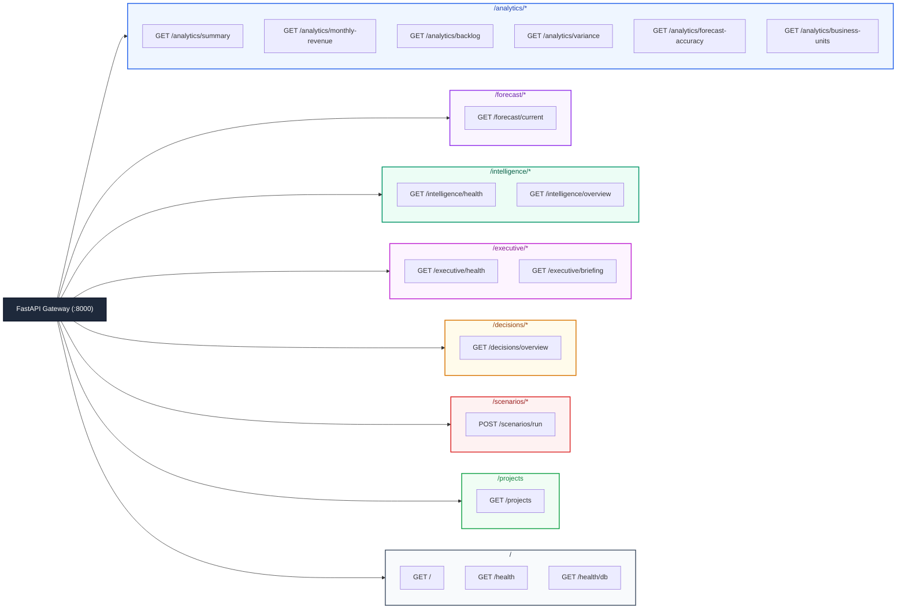
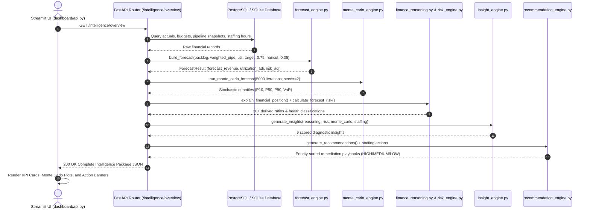

# X-Fin REST API Reference

> **Base URL:** `http://127.0.0.1:8000` · **Framework:** FastAPI 0.115+ · **Specification:** OpenAPI 3.1.0 / JSON

---

## API Route Architecture



---

## Canonical Intelligence Request & Response Sequence



---

## Complete API Route Catalog

| Method | Route Endpoint | Request Body | Response Schema | Description |
|:------:|:---------------|:-------------|:----------------|:------------|
| `GET` | `/` | None | `Dict[str, str]` | Application metadata, name, version, and status |
| `GET` | `/health` | None | `HealthStatus` | System health check probe |
| `GET` | `/health/db` | None | `Dict[str, str]` | Database connection health status |
| `GET` | `/forecast/current` | None | `ForecastResponse` | Current period deliverable forecast with backlog & pipeline split |
| `GET` | `/analytics/summary` | None | `FinanceSummary` | Aggregated recognized actuals, operating budgets, and backlog |
| `GET` | `/analytics/monthly-revenue` | None | `List[MonthlyRevenue]` | Monthly recognized delivery fees, hours, and direct costs |
| `GET` | `/analytics/backlog` | None | `BacklogResponse` | Committed vs uncommitted backlog and stage waterfall |
| `GET` | `/analytics/variance` | None | `VarianceResult` | Actual vs budget and forecast vs budget variance bridges |
| `GET` | `/analytics/forecast-accuracy`| None | `List[AccuracyItem]` | Historical month-by-month actual vs budget accuracy |
| `GET` | `/analytics/business-units` | None | `List[BUPerformance]` | BU-level revenue, gross margin, hours, and project count |
| `GET` | `/intelligence/health` | None | `HealthStatus` | Intelligence subsystem health status |
| `GET` | `/intelligence/overview` | None | `IntelligencePackage` | Full 360° financial intelligence bundle |
| `GET` | `/executive/health` | None | `Dict[str, str]` | Executive briefing subsystem health check |
| `GET` | `/executive/briefing` | None | `Dict[str, Any]` | High-level leadership decision briefing with critical actions |
| `GET` | `/decisions/overview` | None | `Dict[str, Any]` | Standardized decision triggers and recommendations |
| `POST` | `/scenarios/run` | `ScenarioRequest` | `ScenarioResult` | Multi-parameter what-if sensitivity simulation |
| `GET` | `/projects` | None | `List[Dict[str, Any]]` | Project directory with stage, contract value, and billing rate |

---

## Scenario Simulation Schema (`POST /scenarios/run`)

### Request JSON Payload

```json
{
  "base_revenue": 100000.0,
  "pipeline_revenue": 50000.0,
  "utilization": 0.74,
  "pipeline_conversion_change": 0.10,
  "utilization_change": 0.02,
  "billing_rate_change": 0.05,
  "slippage_rate": 0.03
}
```

### Response JSON Payload

```json
{
  "scenario_revenue": 147825.0,
  "revenue_change": 47825.0,
  "revenue_change_pct": 47.83,
  "parameters": {
    "pipeline_conversion_change": 0.10,
    "utilization_change": 0.02,
    "billing_rate_change": 0.05,
    "slippage_rate": 0.03
  }
}
```
