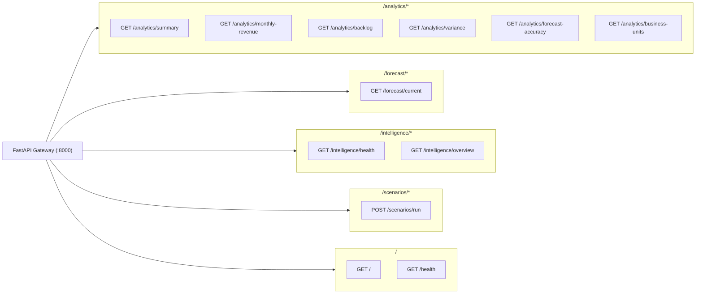
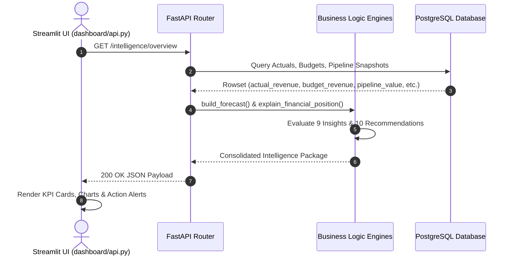
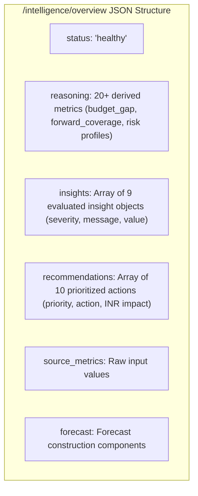

# X-Fin REST API Reference

> **Base URL:** `http://127.0.0.1:8000` · **Framework:** FastAPI 0.115+ · **Specification:** OpenAPI 3.1.0 / JSON

---

## API Route Architecture



---

## Request & Response Sequence Diagram



---

## API Endpoint Specifications

### 1. System Health & Metadata

| Method | Endpoint Path | Return Type | Description |
|:------:|:--------------|:------------|:------------|
| `GET` | `/` | `JSON Object` | Application name, version, status, description |
| `GET` | `/health` | `JSON Object` | Standard operational health check |

---

### 2. `GET /forecast/current`
Calculates the current deterministic revenue forecast.

**Response Structure (`200 OK`)**

```json
{
  "forecast": {
    "committed_backlog": 100000.0,
    "weighted_pipeline": 50000.0,
    "utilization_adjustment": 0.0,
    "risk_adjustment": 7500.0,
    "forecast_revenue": 142500.0
  },
  "pipeline": {
    "opportunities": 45,
    "pipeline_value": 350000.0,
    "weighted_pipeline": 50000.0
  },
  "backlog": {
    "committed_backlog": 100000.0,
    "uncommitted_pipeline": 300000.0,
    "total_coverage": 400000.0
  }
}
```

---

### 3. Analytics Endpoints

| Method | Route | Input Parameters | Output Model | Description |
|:------:|:------|:----------------:|:-------------|:------------|
| `GET` | `/analytics/summary` | None | `FinanceSummary` | Unified financial metrics (actuals, budget, backlog) |
| `GET` | `/analytics/monthly-revenue` | None | `List[MonthlyRevenue]` | Monthly delivery actuals time series |
| `GET` | `/analytics/backlog` | None | `BacklogResponse` | Committed vs uncommitted backlog and waterfall |
| `GET` | `/analytics/variance` | None | `VarianceResult` | Actual vs budget and forecast vs budget variance |
| `GET` | `/analytics/forecast-accuracy` | None | `List[AccuracyItem]` | Historical forecast accuracy series |
| `GET` | `/analytics/business-units` | None | `List[BUPerformance]` | BU-level revenue, margin, and hours breakdown |

---

### 4. `GET /intelligence/overview`
Returns the complete financial reasoning, insights, and recommendations payload.



---

### 5. `POST /scenarios/run`
Simulates the financial impact of parameter shocks.

**Request Schema**

| Field Name | Type | Required | Default | Description |
|:-----------|:----:|:--------:|:-------:|:------------|
| `base_revenue` | `float` | Yes | — | Base committed revenue |
| `pipeline_revenue` | `float` | Yes | — | Unadjusted pipeline deal volume |
| `utilization` | `float` | Yes | — | Baseline utilization rate (e.g. 0.74) |
| `pipeline_conversion_change` | `float` | No | `0.0` | Conversion rate delta (e.g. `+0.10`) |
| `utilization_change` | `float` | No | `0.0` | Staffing utilization delta (e.g. `+0.02`) |
| `billing_rate_change` | `float` | No | `0.0` | Hourly rate delta (e.g. `+0.05`) |
| `slippage_rate` | `float` | No | `0.0` | Revenue delay haircut (e.g. `0.03`) |

**Sample Request Payload**

```json
{
  "base_revenue": 5000000,
  "pipeline_revenue": 2000000,
  "utilization": 0.74,
  "pipeline_conversion_change": 0.10,
  "utilization_change": 0.02,
  "billing_rate_change": 0.05,
  "slippage_rate": 0.03
}
```

**Sample Response Payload**

```json
{
  "base_revenue": 5000000.0,
  "adjusted_pipeline": 2200000.0,
  "adjusted_utilization": 0.76,
  "scenario_revenue": 7451200.0,
  "revenue_change": 2451200.0,
  "revenue_change_pct": 49.02
}
```
