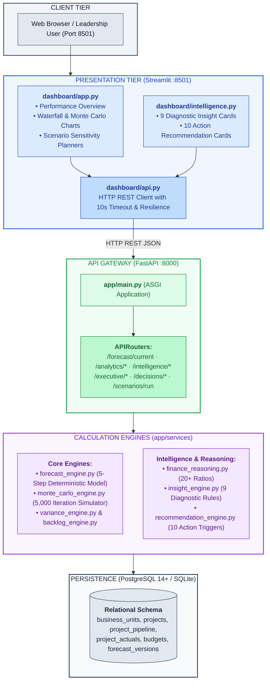
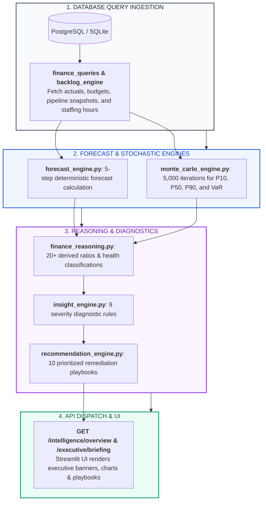
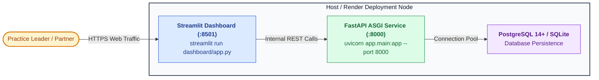

# X-Fin Architecture Overview

> **Version:** 1.0.0 · **Target Environment:** Python 3.10+ / FastAPI / PostgreSQL 14+ (with SQLite Fallback) / Streamlit

---

## Architectural Topology

---

## Canonical Intelligence Data Flow Pipeline

---

## Architectural Component Responsibilities

| Layer | Component Module | Primary Functionality | Dependencies | Output Interface |
|:------|:-----------------|:----------------------|:-------------|:-----------------|
| **Presentation** | `dashboard/app.py` | Multi-tab executive decision dashboard | `streamlit`, `plotly`, `api.py` | Browser UI (:8501) |
| **Presentation** | `dashboard/intelligence.py` | Scored insight cards & action trigger lists | `streamlit`, `components.py` | Browser UI Subview |
| **Presentation** | `dashboard/charts.py` | Themed Plotly chart factory functions | `plotly.graph_objects`, `plotly.express` | Plotly Figure objects |
| **Presentation** | `dashboard/api.py` | Resilient REST client with retry/error handling | `requests` | Python dictionaries |
| **API Gateway** | `app/main.py` | FastAPI application initialization & middleware | `fastapi`, `uvicorn` | ASGI HTTP Server (:8000) |
| **API Gateway** | `app/routers/*` | Endpoint routing, dependency injection, auth | `fastapi.APIRouter`, `get_db` | JSON REST responses |
| **Service Engine**| `forecast_engine.py` | Deterministic 5-step deliverable forecast | Pure Python / `dataclasses` | `ForecastResult` |
| **Service Engine**| `monte_carlo_engine.py`| 5,000-iteration stochastic simulation | `random`, `math` | Distribution & VaR quantiles |
| **Service Engine**| `finance_reasoning.py`| 20+ derived practice ratios & classifications | Pure Python | Ratios dictionary |
| **Service Engine**| `insight_engine.py` | 9 diagnostic severity evaluators | `finance_reasoning` | Scored insights array |
| **Service Engine**| `recommendation_engine.py`| 10 prioritized remediation playbooks | `insight_engine`, `finance_reasoning` | Action recommendations |
| **Service Engine**| `staffing_engine.py` | Hours budget vs actuals & data quality flag | `SQLAlchemy` | Staffing position dict |
| **Persistence** | `app/db/connection.py`| Connection pooling with SQLite fallback | `SQLAlchemy` | `Session` generator |

---

## Architectural Decision Records (ADRs)

| # | Architecture Decision | Chosen Implementation | Technical & Business Rationale | Trade-offs & Alternatives |
|:--:|:----------------------|:----------------------|:-------------------------------|:--------------------------|
| **ADR-001** | **Deterministic Baseline** | 5-Step Rule Formulation | Consulting leadership requires 100% auditable mathematics with transparent haircut rules. | Black-box ML models (ARIMA/Prophet) were rejected due to lack of explainability. |
| **ADR-002** | **Stochastic Complement** | Monte Carlo (5,000 runs) | Provides empirical confidence intervals (P10/P50/P90) and VaR without obfuscating deterministic baseline. | Static sensitivity scenarios alone fail to capture multi-variable co-variance. |
| **ADR-003** | **Data Persistence** | Dual PostgreSQL / SQLite | Enables zero-config local evaluation out-of-the-box while maintaining production PostgreSQL compatibility. | Pure PostgreSQL requires local server daemon installation. |
| **ADR-004** | **Query Strategy** | Raw SQL via SQLAlchemy `text()` | Complex multi-table joins and window aggregations execute with zero ORM overhead. | Full ORM querysets introduce query generation latency. |
| **ADR-005** | **Decoupled Architecture** | Pure Python Services | Logic in `app/services` has zero coupling to HTTP frameworks, enabling fast pytest unit execution. | Embedding calculations directly in router handlers creates tightly coupled code. |

---

## Deployment & Production Topology

