# X-Fin Architecture Overview

> **Version:** 1.0.0 · **Target Environment:** Python 3.10+ / FastAPI / PostgreSQL 14+ / Streamlit

---

## Architectural Topology

```mermaid
graph TB
    subgraph Client["CLIENT TIER"]
        BROWSER["Web Browser (Port 8501)"]
    end

    subgraph PresentationTier["PRESENTATION TIER (Streamlit :8501)"]
        UI_MAIN["<b>dashboard/app.py</b><br/>• Executive Performance Overview<br/>• Revenue Performance Line Chart<br/>• Backlog Waterfall Chart<br/>• Business Unit Margins Grouped Chart<br/>• Forecast Accuracy Time Series<br/>• Scenario Planning Sliders"]
        UI_INTEL["<b>dashboard/intelligence.py</b><br/>• Financial Status Banner<br/>• Revenue Outlook Comparison Bar<br/>• Forward Revenue Split Bar<br/>• Forecast Construction Dataframe<br/>• Scored Insights Cards<br/>• Action Recommendations Cards"]
        UI_CHARTS["<b>dashboard/charts.py</b><br/>Plotly Chart Builders (Line, Bar, Waterfall)"]
        UI_COMP["<b>dashboard/components.py</b><br/>UI Helper Functions & Formatters"]
        UI_API["<b>dashboard/api.py</b><br/>Requests HTTP Client with 10s Timeout"]

        UI_MAIN & UI_INTEL --> UI_CHARTS
        UI_MAIN & UI_INTEL --> UI_COMP
        UI_MAIN & UI_INTEL --> UI_API
    end

    subgraph APITier["API GATEWAY TIER (FastAPI :8000)"]
        MAIN["<b>app/main.py</b><br/>FastAPI Application Factory & CORS Middleware"]
        subgraph Routers["FastAPI APIRouters"]
            R_FORECAST["<b>routers/forecast.py</b><br/>GET /forecast/current"]
            R_ANALYTICS["<b>routers/analytics.py</b><br/>GET /analytics/summary<br/>GET /analytics/monthly-revenue<br/>GET /analytics/backlog<br/>GET /analytics/variance<br/>GET /analytics/forecast-accuracy<br/>GET /analytics/business-units"]
            R_INTEL["<b>routers/intelligence.py</b><br/>GET /intelligence/health<br/>GET /intelligence/overview"]
            R_SCENARIOS["<b>routers/scenarios.py</b><br/>POST /scenarios/run"]
            R_PROJECTS["<b>routers/projects.py</b><br/>GET /projects"]
        end
        MAIN --> Routers
    end

    subgraph ServiceTier["SERVICE & BUSINESS LOGIC TIER (app/services)"]
        S_FC["<b>forecast_engine.py</b><br/>build_forecast()"]
        S_BL["<b>backlog_engine.py</b><br/>calculate_backlog(), calculate_backlog_waterfall()"]
        S_VR["<b>variance_engine.py</b><br/>calculate_variance(), variance_bridge()"]
        S_RS["<b>finance_reasoning.py</b><br/>explain_financial_position()"]
        S_IN["<b>insight_engine.py</b><br/>generate_insights()"]
        S_RC["<b>recommendation_engine.py</b><br/>generate_recommendations()"]
        S_SC["<b>scenario_engine.py</b><br/>run_scenario()"]
        S_BU["<b>business_unit_engine.py</b><br/>get_bu_performance()"]
        S_FA["<b>forecast_accuracy.py</b><br/>get_forecast_accuracy()"]
        S_FQ["<b>finance_queries.py</b><br/>get_finance_summary(), get_pipeline_summary(), get_budget_summary(), get_monthly_revenue()"]
        S_STF["<b>staffing_engine.py</b><br/>calculate_staffing_position()"]
        S_STI["<b>staffing_insight_engine.py</b><br/>generate_staffing_insights()"]
        S_STR["<b>staffing_recommendation_engine.py</b><br/>generate_staffing_recommendations()"]
    end

    subgraph DataTier["DATA PERSISTENCE TIER (PostgreSQL 14+)"]
        DB_CONN["<b>app/db/connection.py</b><br/>SQLAlchemy create_engine() & get_db() sessionmaker"]
        subgraph Tables["Relational Tables (app/db/schema.sql)"]
            T_BU[("business_units")]
            T_PR[("projects")]
            T_PL[("project_pipeline")]
            T_AC[("project_actuals")]
            T_BG[("budgets")]
            T_FV[("forecast_versions")]
            T_VL[("forecast_values")]
        end
        DB_CONN --> Tables
    end

    BROWSER --> PresentationTier
    UI_API -->|HTTP REST JSON| APITier
    Routers --> ServiceTier
    ServiceTier --> DB_CONN

    style Client fill:#F1F5F9,stroke:#475569,stroke-width:2px,color:#0F172A
    style PresentationTier fill:#EFF6FF,stroke:#2563EB,stroke-width:2px,color:#1E40AF
    style APITier fill:#F0FDF4,stroke:#16A34A,stroke-width:2px,color:#15803D
    style ServiceTier fill:#FAF5FF,stroke:#9333EA,stroke-width:2px,color:#6B21A8
    style DataTier fill:#F8FAFC,stroke:#334155,stroke-width:2px,color:#1E293B

    style BROWSER fill:#E2E8F0,stroke:#475569,stroke-width:1px,color:#0F172A

    style UI_MAIN fill:#DBEAFE,stroke:#1D4ED8,stroke-width:1px,color:#1E3A8A
    style UI_INTEL fill:#DBEAFE,stroke:#1D4ED8,stroke-width:1px,color:#1E3A8A
    style UI_CHARTS fill:#BFDBFE,stroke:#1D4ED8,stroke-width:1px,color:#1E3A8A
    style UI_COMP fill:#BFDBFE,stroke:#1D4ED8,stroke-width:1px,color:#1E3A8A
    style UI_API fill:#93C5FD,stroke:#1D4ED8,stroke-width:1px,color:#1E3A8A

    style MAIN fill:#DCFCE7,stroke:#15803D,stroke-width:1px,color:#166534
    style Routers fill:#BBF7D0,stroke:#15803D,stroke-width:1px,color:#166534

    style S_FC fill:#F3E8FF,stroke:#7E22CE,stroke-width:1px,color:#581C87
    style S_BL fill:#F3E8FF,stroke:#7E22CE,stroke-width:1px,color:#581C87
    style S_VR fill:#F3E8FF,stroke:#7E22CE,stroke-width:1px,color:#581C87
    style S_RS fill:#F3E8FF,stroke:#7E22CE,stroke-width:1px,color:#581C87
    style S_IN fill:#F3E8FF,stroke:#7E22CE,stroke-width:1px,color:#581C87
    style S_RC fill:#F3E8FF,stroke:#7E22CE,stroke-width:1px,color:#581C87
    style S_SC fill:#F3E8FF,stroke:#7E22CE,stroke-width:1px,color:#581C87
    style S_BU fill:#F3E8FF,stroke:#7E22CE,stroke-width:1px,color:#581C87
    style S_FA fill:#F3E8FF,stroke:#7E22CE,stroke-width:1px,color:#581C87
    style S_FQ fill:#F3E8FF,stroke:#7E22CE,stroke-width:1px,color:#581C87

    style DB_CONN fill:#E2E8F0,stroke:#334155,stroke-width:1px,color:#0F172A
    style Tables fill:#CBD5E1,stroke:#334155,stroke-width:1px,color:#0F172A
```



---

## Intelligence Subsystem Data Flow Pipeline

```mermaid
flowchart TD
    subgraph Ingestion["1. DATABASE QUERY EXECUTION"]
        DB[(PostgreSQL)]
        Q1["<b>finance_queries.get_finance_summary(db)</b><br/>SELECT COALESCE(SUM(actual_revenue),0), COALESCE(SUM(actual_cost),0), COALESCE(SUM(contract_value),0)"]
        Q2["<b>finance_queries.get_budget_summary(db)</b><br/>SELECT COALESCE(SUM(revenue_budget),0), COALESCE(AVG(utilization_budget),0)"]
        Q3["<b>finance_queries.get_pipeline_summary(db)</b><br/>SELECT COUNT(*), SUM(pipeline_value), SUM(pipeline_value * probability) [Latest Snapshot]"]
        Q4["<b>backlog_engine.calculate_backlog(db)</b><br/>SELECT SUM(pipeline_value) WHERE stage IN ('In Delivery', 'Closed Won') vs ('Prospect', 'Qualified')"]

        DB --> Q1 & Q2 & Q3 & Q4
    end

    subgraph ForecastStage["2. FORECAST SYNTHESIS (forecast_engine.py)"]
        F1["<b>forecast_engine.build_forecast()</b><br/>Inputs: committed_backlog, weighted_pipeline, utilization=budget_utilization, target=0.75, risk=0.05<br/>1. Factor = utilization / 0.75<br/>2. Util_Adj = committed_backlog * (Factor - 1.0)<br/>3. Gross = committed_backlog + weighted_pipeline + Util_Adj<br/>4. Risk_Adj = Gross * 0.05<br/>5. Net Forecast = Gross - Risk_Adj"]
        Q3 & Q4 & Q2 --> F1
        F1 --> F_OUT["<b>ForecastResult Dataclass</b><br/>forecast_revenue, committed_backlog, weighted_pipeline, utilization_adjustment, risk_adjustment"]
    end

    subgraph ReasoningStage["3. FINANCE REASONING (finance_reasoning.py)"]
        R1["<b>finance_reasoning.explain_financial_position()</b><br/>Inputs: actual_revenue, budget_revenue, forecast_revenue, committed_backlog, weighted_pipeline<br/>Computes 20+ Financial Ratios & Classifications:<br/>• budget_gap = actual - budget | budget_gap_pct<br/>• forecast_gap = forecast - budget | forecast_gap_pct<br/>• forward_revenue = committed + weighted<br/>• forward_coverage = (forward_revenue / budget) * 100<br/>• committed_forecast_coverage = (committed / forecast) * 100<br/>• pipeline_dependency = (weighted / forward) * 100<br/>• committed_revenue_mix = (committed / forward) * 100<br/>• forecast_risk: 'low' | 'moderate' | 'high'<br/>• pipeline_risk: 'low' | 'moderate' | 'high'<br/>• forward_position: 'strong' | 'adequate' | 'watch' | 'weak'"]
        Q1 & Q2 & F_OUT & Q4 & Q3 --> R1
        R1 --> R_OUT["<b>Reasoning Output Dictionary</b>"]
    end

    subgraph InsightStage["4. INSIGHT SCORING (insight_engine.py)"]
        I1["<b>insight_engine.generate_insights()</b><br/>Evaluates 9 Deterministic Severity Rules:<br/>1. Actual vs Budget<br/>2. Forecast vs Budget<br/>3. Forward Revenue Coverage<br/>4. Committed Forecast Coverage<br/>5. Pipeline Dependency<br/>6. Committed Revenue Mix<br/>7. Forecast Risk Profile<br/>8. Forward Market Stance<br/>9. Forecast Headroom Buffer"]
        R_OUT --> I1
        I1 --> I_OUT["<b>Array of Scored Insight Dictionaries</b><br/>[{severity: 'HIGH'|'MEDIUM'|'LOW', category, metric, message, value}]"]
    end

    subgraph RecommendationStage["5. ACTION RECOMMENDATIONS (recommendation_engine.py + staffing engines)"]
        REC1["<b>recommendation_engine.generate_recommendations()</b><br/>Evaluates 10 Action Rules with Priority Sorting<br/><br/><b>PLUS: staffing_insight_engine.generate_staffing_insights()</b><br/>Generates staffing-specific insights<br/><br/><b>PLUS: staffing_recommendation_engine.generate_staffing_recommendations()</b><br/>Generates staffing data validation recommendations<br/><br/>Merge all components by priority and uniqueness"]
        R_OUT & I_OUT --> REC1
        REC1 --> REC_OUT["<b>Merged Array of Recommendation Dictionaries</b><br/>10+ items: [{priority: 'HIGH'|'MEDIUM'|'LOW', category, action, rationale, financial_impact}]<br/>Staffing recommendations merged when category unique"]
    end

    subgraph DeliveryStage["6. API RESPONSE DISPATCH"]
        EP["<b>GET /intelligence/overview</b><br/>JSON Package: status, reasoning, insights, recommendations, staffing_insights, staffing_recommendations, source_metrics, forecast"]
        R_OUT & I_OUT & REC_OUT --> EP
        EP --> ST["<b>dashboard/intelligence.py</b><br/>Render Executive Streamlit UI with staffing alerts"]
    end

    Ingestion --> ForecastStage --> ReasoningStage --> InsightStage --> RecommendationStage --> DeliveryStage

    style Ingestion fill:#F8FAFC,stroke:#475569,stroke-width:2px,color:#1E293B
    style ForecastStage fill:#EFF6FF,stroke:#2563EB,stroke-width:2px,color:#1E40AF
    style ReasoningStage fill:#FAF5FF,stroke:#9333EA,stroke-width:2px,color:#6B21A8
    style InsightStage fill:#FFFBEB,stroke:#D97706,stroke-width:2px,color:#92400E
    style RecommendationStage fill:#ECFDF5,stroke:#059669,stroke-width:2px,color:#065F46
    style DeliveryStage fill:#F0FDF4,stroke:#16A34A,stroke-width:2px,color:#15803D

    style DB fill:#E2E8F0,stroke:#334155,stroke-width:1px,color:#0F172A
    style Q1 fill:#E2E8F0,stroke:#334155,stroke-width:1px,color:#0F172A
    style Q2 fill:#E2E8F0,stroke:#334155,stroke-width:1px,color:#0F172A
    style Q3 fill:#E2E8F0,stroke:#334155,stroke-width:1px,color:#0F172A
    style Q4 fill:#E2E8F0,stroke:#334155,stroke-width:1px,color:#0F172A

    style F1 fill:#DBEAFE,stroke:#1D4ED8,stroke-width:1px,color:#1E3A8A
    style F_OUT fill:#BFDBFE,stroke:#1D4ED8,stroke-width:1px,color:#1E3A8A

    style R1 fill:#F3E8FF,stroke:#7E22CE,stroke-width:1px,color:#581C87
    style R_OUT fill:#E9D5FF,stroke:#7E22CE,stroke-width:1px,color:#581C87

    style I1 fill:#FEF3C7,stroke:#B45309,stroke-width:1px,color:#78350F
    style I_OUT fill:#FDE68A,stroke:#B45309,stroke-width:1px,color:#78350F

    style REC1 fill:#D1FAE5,stroke:#047857,stroke-width:1px,color:#064E3B
    style REC_OUT fill:#A7F3D0,stroke:#047857,stroke-width:1px,color:#064E3B

    style EP fill:#BBF7D0,stroke:#15803D,stroke-width:1px,color:#166534
    style ST fill:#86EFAC,stroke:#15803D,stroke-width:2px,color:#14532D
```



---

## Architectural Decision Records (ADRs)

| Decision Item | Chosen Approach | Rationale | Alternatives Evaluated |
|:--------------|:----------------|:----------|:-----------------------|
| **Forecasting Model** | Deterministic Rule-Based Engine | In enterprise delivery finance, all adjustments must be audit-compliant and mathematically verifiable. | Time-series ML (ARIMA/Prophet) was rejected due to black-box explainability issues in partner reviews. |
| **Data Querying** | Raw SQL with SQLAlchemy `text()` | Complex multi-table financial rollups require explicit `COALESCE`, `DATE_TRUNC`, and window aggregations. | Heavy ORM querysets introduce query latency and serialization overhead. |
| **Pipeline Storage** | Point-in-Time Snapshot Table | Tracking stage conversion and deal velocity requires immutable historical snapshots per snapshot date. | In-place update tables overwrite past states, destroying pipeline velocity analytics. |
| **Decoupled Architecture** | Pure Python Logic in `app/services` | Service modules have zero dependencies on FastAPI request contexts, enabling standalone unit testing. | Embedding calculations directly inside router endpoints creates coupling. |
| **UI Presentation** | Streamlit + Plotly Engine | Enables interactive executive dashboarding with minimal frontend boilerplate. | React / Vue SPA was evaluated but Streamlit provides native Python analytics integration. |

---

## Deployment & Network Topology

```mermaid
graph LR
    subgraph Host["Container / Local Host Environment"]
        subgraph ServiceStreamlit["Streamlit Service (Port 8501)"]
            ST_APP["streamlit run dashboard/app.py"]
        end

        subgraph ServiceFastAPI["FastAPI ASGI Server (Port 8000)"]
            UV["uvicorn app.main:app --port 8000"]
        end

        subgraph ServicePostgres["PostgreSQL Database (Port 5432)"]
            PG["consulting_forecast Database"]
        end
    end

    User(["Executive / Finance Lead"]) -->|HTTP Browser Request| ST_APP
    ST_APP -->|Internal REST API Calls (127.0.0.1:8000)| UV
    UV -->|Connection Pooling / TCP :5432| PG

    style Host fill:#F8FAFC,stroke:#334155,stroke-width:2px,color:#0F172A
    style ServiceStreamlit fill:#EFF6FF,stroke:#2563EB,stroke-width:2px,color:#1E40AF
    style ServiceFastAPI fill:#F0FDF4,stroke:#16A34A,stroke-width:2px,color:#15803D
    style ServicePostgres fill:#FAF5FF,stroke:#9333EA,stroke-width:2px,color:#6B21A8

    style User fill:#FEF3C7,stroke:#D97706,stroke-width:2px,color:#92400E
    style ST_APP fill:#DBEAFE,stroke:#1D4ED8,stroke-width:1px,color:#1E3A8A
    style UV fill:#DCFCE7,stroke:#15803D,stroke-width:1px,color:#166534
    style PG fill:#F3E8FF,stroke:#7E22CE,stroke-width:1px,color:#581C87
```
