# X-Fin Leadership Decision Surface Guide

> **Module Path:** `dashboard/app.py` · **Supporting Modules:** `dashboard/intelligence.py`, `dashboard/charts.py`, `dashboard/components.py`, `dashboard/api.py`

---

## Decision Dashboard Architecture & Layout

```mermaid
flowchart TD
    subgraph S1["1. DECISION SNAPSHOT & LEADERSHIP READOUT"]
        D1["<b>Forecast Confidence (%)</b><br/>Monte Carlo Probability"]
        D2["<b>Revenue at Risk (INR)</b><br/>Conversion-Dependent Pipe"]
        D3["<b>Delivery Signal</b><br/>Capacity Attainment & Guardrail"]
        D4["<b>Leadership Readout</b><br/>Plain-language executive summary"]
    end

    subgraph S2["2. EXECUTIVE KPI PERFORMANCE BANNER"]
        K1["Actual Revenue"]
        K2["Operating Budget"]
        K3["Net Forecast"]
        K4["Forward Coverage"]
        K5["Committed Mix"]
        K6["Pipeline Risk"]
        K7["Utilization Target"]
    end

    subgraph S3["3. ANALYTICAL VISUALIZATION & RISK DECOMPOSITION"]
        V1["<b>Forecast Waterfall Chart</b><br/>Backlog -> Pipe -> Util Adj -> Haircut -> Net"]
        V2["<b>Monte Carlo Density Plot</b><br/>P10, P25, P50, P75, P90 vs Budget Target"]
        V3["<b>Risk-Driver Gauge Comparison</b><br/>Coverage vs Dependency vs Headroom"]
        V4["<b>Staffing & Capacity Attainment</b><br/>Delivered Hours vs Budget with Caveat Banner"]
    end

    subgraph S4["4. PRACTICE PERFORMANCE & ACCURACY MATRIX"]
        P1["<b>Business Unit Performance</b><br/>Revenue, Gross Margin %, Project Count Heatmap"]
        P2["<b>Historical Forecast Accuracy</b><br/>Month-by-month recognized vs planned variance"]
        P3["<b>Monthly Revenue Trajectory</b><br/>Time series trends across billing cycles"]
    end

    subgraph S5["5. ACTIONABLE DECISION INTELLIGENCE & SCENARIO SIMULATOR"]
        I1["<b>9 Scored Diagnostic Insight Cards</b><br/>Color-coded HIGH / MEDIUM / LOW severity badges"]
        I2["<b>10 Prioritized Action Remediations</b><br/>Prescriptive playbooks with quantified INR financial impact"]
        I3["<b>Interactive What-If Scenario Simulator</b><br/>Sensitivity sliders for conversion, rates, util, and slippage"]
    end

    S1 --> S2 --> S3 --> S4 --> S5

    style S1 fill:#EFF6FF,stroke:#2563EB,stroke-width:2px,color:#1E40AF
    style S2 fill:#FAF5FF,stroke:#9333EA,stroke-width:2px,color:#6B21A8
    style S3 fill:#FFFBEB,stroke:#D97706,stroke-width:2px,color:#92400E
    style S4 fill:#F0FDF4,stroke:#16A34A,stroke-width:2px,color:#15803D
    style S5 fill:#ECFDF5,stroke:#059669,stroke-width:2px,color:#065F46
```

---

## Leadership Decision Pillars & UI Component Directory

| Section Name | Key Visual Components | Telemetry Source | Primary Leadership Decision Question |
|:-------------|:----------------------|:-----------------|:-------------------------------------|
| **Decision Snapshot** | 3 Metric Gauges + Text Card | `monte_carlo`, `risk`, `staffing` | What is our aggregate forecast confidence and primary watchpoint? |
| **Executive Performance** | 8 KPI Metric Cards with deltas | `finance_summary`, `budgets` | Are we on track to hit our annual revenue and gross margin targets? |
| **Forecast Waterfall** | Plotly Step-by-Step Waterfall | `forecast_decomposition` | How is the net deliverable forecast mathematically constructed? |
| **Monte Carlo Distribution** | Plotly Bell-Curve / Quantile Area | `monte_carlo_engine` | What is our downside exposure (P10/VaR) vs upside capture (P90)? |
| **Risk-Driver Comparison** | Multi-Bar Risk Ratio Comparison | `finance_reasoning` | What portion of our forward book is secured by locked contracts? |
| **Staffing & Capacity** | Bar Chart + Warning Banner | `staffing_engine` | Can current delivery staffing hours support pipeline demand? |
| **BU Heatmap & Trends** | Interactive Heatmap & Line Plots | `business_unit_engine` | Which regional delivery practice hub is lagging behind plan? |
| **Diagnostic Insights** | 9 Expandable Severity Cards | `insight_engine` | What specific operational vulnerabilities require investigation? |
| **Action Recommendations**| 10 Quantified Remediation Cards | `recommendation_engine` | What concrete operational actions will yield the highest financial return? |
| **Scenario Simulator** | 5 Sensitivity Sliders + Delta Card | `scenario_engine` | What happens if pipeline conversion drops 10% or projects slip 30 days? |

---

## Interactive Scenario Simulator Controls

```mermaid
flowchart LR
    subgraph Sliders["User Input Controls (Streamlit Sliders)"]
        S_CONV["<b>Pipeline Conversion Change</b><br/>Range: -50% to +50%"]
        S_UTIL["<b>Staffing Utilization Change</b><br/>Range: -15% to +15%"]
        S_RATE["<b>Billing Rate Adjustment</b><br/>Range: -20% to +20%"]
        S_SLIP["<b>Delivery Slippage Rate</b><br/>Range: 0% to 30%"]
    end

    subgraph Engine["FastAPI POST /scenarios/run"]
        E_CALC["Calculate Parametric Revenue Adjustments"]
    end

    subgraph Output["Dashboard Impact Render"]
        O_REV["<b>Simulated Revenue ($R_{sim}$)</b>"]
        O_DEL["<b>Absolute Delta ($\Delta_{\text{INR}}$)</b>"]
        O_PCT["<b>Percentage Delta ($\Delta_{\%}$)</b>"]
    end

    Sliders --> Engine --> Output

    style Sliders fill:#EFF6FF,stroke:#2563EB,stroke-width:2px,color:#1E40AF
    style Engine fill:#FAF5FF,stroke:#9333EA,stroke-width:2px,color:#6B21A8
    style Output fill:#ECFDF5,stroke:#059669,stroke-width:2px,color:#065F46
```

---

## Design System & Semantic Color Tokens

| Semantic Role | Hex Code | Visual Meaning | Usage in Dashboard |
|:--------------|:--------:|:---------------|:-------------------|
| **Primary Brand** | `#2563EB` | Blue / Cyan | Baseline metrics, headers, neutral forecast trajectories |
| **Positive / Favorable** | `#16A34A` | Emerald Green | Beating budget, committed backlog, low-risk classifications |
| **Warning / Attention** | `#D97706` | Amber Gold | Pipeline dependency 40–60%, moderate headroom, conversion drag |
| **Critical Risk / Deficit** | `#DC2626` | Crimson Red | Budget deficit, high forecast risk, staffing data quality review |
| **Dark Canvas Background** | `#0F172A` | Slate 900 | Main viewport canvas background |
| **Elevated Surface Card** | `#1E293B` | Slate 800 | Container card background with subtle border radius |
