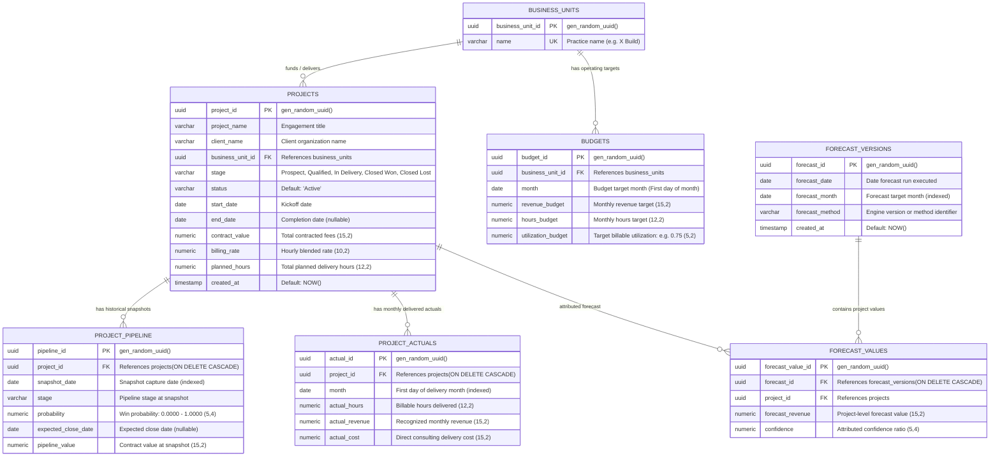
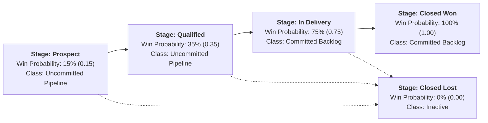
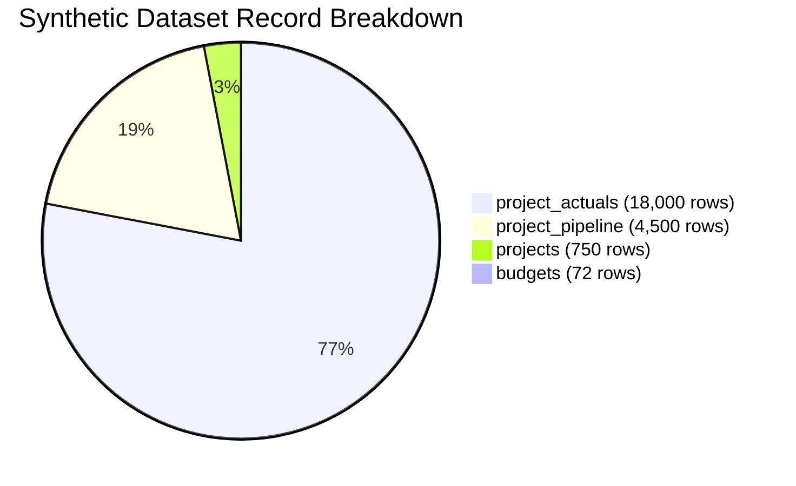

# X-Fin Relational Data Model & Schema Specification

> **Database:** PostgreSQL 14+ · **ORM:** SQLAlchemy · **DDL File:** `app/db/schema.sql`

---

## Entity Relationship Diagram (ERD)

---

## Pipeline Stages & Win Probability Matrix

---

## Database Table Specifications

### 1. `business_units`
Stores the high-level delivery practice units.

| Column Name | PostgreSQL Type | Nullable | Key / Constraint | Functional Description |
|:------------|:----------------|:--------:|:-----------------|:-----------------------|
| `business_unit_id` | `UUID` | No | `PRIMARY KEY`, Default `gen_random_uuid()` | Unique surrogate identifier |
| `name` | `VARCHAR(100)` | No | `UNIQUE` | Business unit name (`X Build`, `X Design`, `Digital Ventures`) |

---

### 2. `projects`
Master registry for consulting client engagements.

| Column Name | PostgreSQL Type | Nullable | Key / Constraint | Functional Description |
|:------------|:----------------|:--------:|:-----------------|:-----------------------|
| `project_id` | `UUID` | No | `PRIMARY KEY`, Default `gen_random_uuid()` | Unique project identifier |
| `project_name` | `VARCHAR(255)` | No | — | Engagement title |
| `client_name` | `VARCHAR(255)` | No | — | Client organization name |
| `business_unit_id` | `UUID` | No | `FOREIGN KEY -> business_units` | Delivering practice |
| `stage` | `VARCHAR(50)` | No | Check constraint valid stage | Current pipeline stage |
| `status` | `VARCHAR(50)` | No | Default `'Active'` | Operational status (`Active`, `Completed`, `On Hold`) |
| `start_date` | `DATE` | No | — | Project kickoff date |
| `end_date` | `DATE` | Yes | — | Completion date |
| `contract_value` | `NUMERIC(15,2)` | No | — | Total contracted revenue (INR) |
| `billing_rate` | `NUMERIC(10,2)` | No | — | Blended hourly billing rate (INR/hr) |
| `planned_hours` | `NUMERIC(12,2)` | No | — | Budgeted billable hours |
| `created_at` | `TIMESTAMP` | No | Default `NOW()` | Insertion timestamp |

---

### 3. `project_pipeline`
Periodic snapshots of project stages, probabilities, and values over time.

| Column Name | PostgreSQL Type | Nullable | Key / Constraint | Functional Description |
|:------------|:----------------|:--------:|:-----------------|:-----------------------|
| `pipeline_id` | `UUID` | No | `PRIMARY KEY`, Default `gen_random_uuid()` | Unique snapshot record ID |
| `project_id` | `UUID` | No | `FOREIGN KEY -> projects(CASCADE)` | Associated engagement |
| `snapshot_date` | `DATE` | No | `INDEX idx_pipeline_snapshot` | Snapshot capture date |
| `stage` | `VARCHAR(50)` | No | — | Stage at snapshot date |
| `probability` | `NUMERIC(5,4)` | No | Value range 0.0000 - 1.0000 | Win probability |
| `expected_close_date` | `DATE` | Yes | — | Expected execution date |
| `pipeline_value` | `NUMERIC(15,2)` | No | — | Estimated deal value (INR) |

---

### 4. `project_actuals`
Monthly delivered effort, revenue, and delivery costs.

| Column Name | PostgreSQL Type | Nullable | Key / Constraint | Functional Description |
|:------------|:----------------|:--------:|:-----------------|:-----------------------|
| `actual_id` | `UUID` | No | `PRIMARY KEY`, Default `gen_random_uuid()` | Unique actuals record ID |
| `project_id` | `UUID` | No | `FOREIGN KEY -> projects(CASCADE)` | Associated engagement |
| `month` | `DATE` | No | `INDEX idx_actuals_month` | First day of delivery month |
| `actual_hours` | `NUMERIC(12,2)` | No | — | Actual billable hours logged |
| `actual_revenue` | `NUMERIC(15,2)` | No | — | Monthly recognized revenue (INR) |
| `actual_cost` | `NUMERIC(15,2)` | No | — | Direct consulting delivery cost (INR) |

> **Unique Constraint:** `UNIQUE (project_id, month)`

---

### 5. `budgets`
Monthly operational budget targets defined per business unit.

| Column Name | PostgreSQL Type | Nullable | Key / Constraint | Functional Description |
|:------------|:----------------|:--------:|:-----------------|:-----------------------|
| `budget_id` | `UUID` | No | `PRIMARY KEY`, Default `gen_random_uuid()` | Unique budget record ID |
| `business_unit_id` | `UUID` | No | `FOREIGN KEY -> business_units` | Associated business unit |
| `month` | `DATE` | No | — | Budget target month |
| `revenue_budget` | `NUMERIC(15,2)` | No | — | Monthly target revenue (INR) |
| `hours_budget` | `NUMERIC(12,2)` | No | — | Monthly target billable hours |
| `utilization_budget` | `NUMERIC(5,2)` | No | — | Target billable utilization (e.g. 0.75) |

> **Unique Constraint:** `UNIQUE (business_unit_id, month)`

---

### 6. `forecast_versions` & `forecast_values`
Audit trail tables for historical forecast runs.

| Table Name | Column Name | PostgreSQL Type | Key / Constraint | Description |
|:-----------|:------------|:----------------|:-----------------|:------------|
| `forecast_versions` | `forecast_id` | `UUID` | `PRIMARY KEY` | Version ID |
| `forecast_versions` | `forecast_date` | `DATE` | — | Run execution date |
| `forecast_versions` | `forecast_month` | `DATE` | `INDEX idx_forecast_month` | Target month |
| `forecast_versions` | `forecast_method` | `VARCHAR(100)` | — | Calculation model ID |
| `forecast_values` | `forecast_value_id` | `UUID` | `PRIMARY KEY` | Record ID |
| `forecast_values` | `forecast_id` | `UUID` | `FOREIGN KEY -> forecast_versions(CASCADE)` | Forecast version link |
| `forecast_values` | `project_id` | `UUID` | `FOREIGN KEY -> projects` | Engagement link |
| `forecast_values` | `forecast_revenue`| `NUMERIC(15,2)` | — | Projected revenue |
| `forecast_values` | `confidence` | `NUMERIC(5,4)` | — | Attributed confidence |

> **Unique Constraint (`forecast_values`):** `UNIQUE (forecast_id, project_id)`

---

## Synthetic Data Generator Profile

| Table | Record Volume | Generation Rule |
|:------|:--------------|:----------------|
| `projects` | 750 records | Randomly assigned to 3 BUs; billing rate ₹150–₹400/hr; hours 200–5000 |
| `project_pipeline` | 4,500 records | 6 monthly snapshots per project |
| `project_actuals` | 18,000 records | 24 monthly records per project (revenue, hours, cost) |
| `budgets` | 72 records | 3 BUs × 24 months (₹4M–₹10M monthly budget per BU) |
