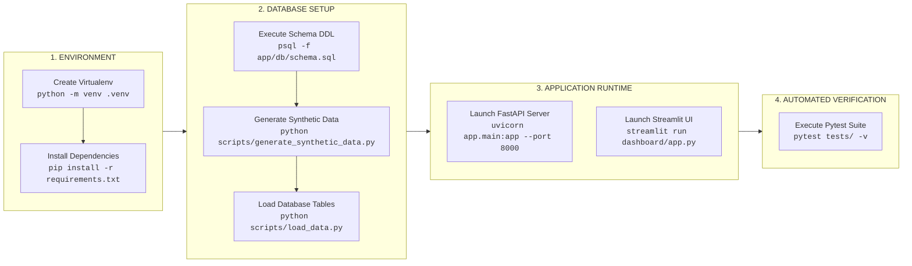
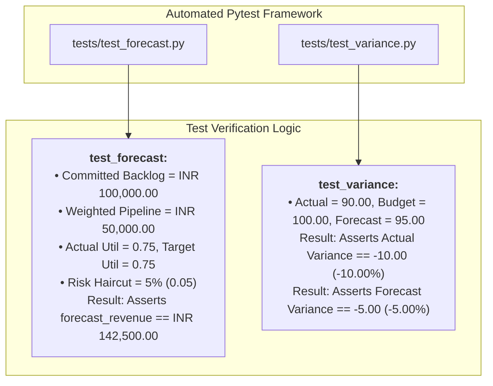
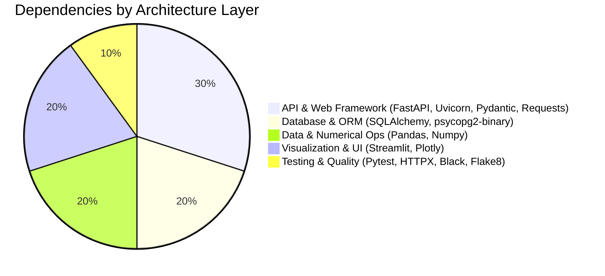
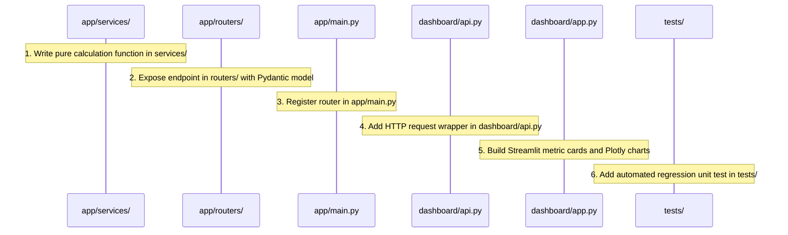

# X-Fin Developer & Operations Manual

> **Technology Stack:** Python 3.10+ · FastAPI · PostgreSQL 14+ · Streamlit · SQLAlchemy · Plotly

---

## Local Development Lifecycle



---

## Automated Verification Suite



Run test suite:
```bash
pytest tests/ -v
```

---

## Dependency Matrix



| Package Name | Minimum Version | Architectural Role | Layer Categorization |
|:-------------|:---------------:|:-------------------|:---------------------|
| `fastapi` | `0.115.0+` | Asynchronous REST API framework | API Gateway |
| `uvicorn` | `0.30.0+` | Production ASGI web server | API Gateway |
| `sqlalchemy` | `2.0.0+` | Database abstraction and raw SQL engine | Persistence |
| `psycopg2-binary` | `2.9.9+` | PostgreSQL database driver adapter | Persistence |
| `pydantic` | `2.8.0+` | Data schema validation and serialisation | API Gateway |
| `pandas` | `2.2.0+` | Tabular data transformations | Analytics & Logic |
| `numpy` | `1.26.0+` | Mathematical operations & distributions | Analytics & Logic |
| `plotly` | `5.22.0+` | Interactive visual charting engine | Presentation |
| `streamlit` | `1.36.0+` | Reactive executive dashboard frontend | Presentation |
| `pytest` | `8.2.0+` | Test execution runner | Quality & Testing |
| `httpx` | `0.27.0+` | Asynchronous test HTTP client | Quality & Testing |
| `requests` | `2.32.0+` | HTTP client for Streamlit UI connector | Presentation |

---

## New Endpoint Development Workflow


