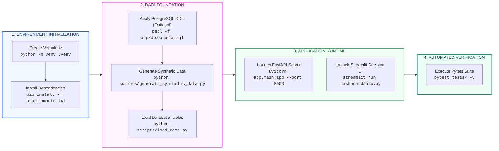
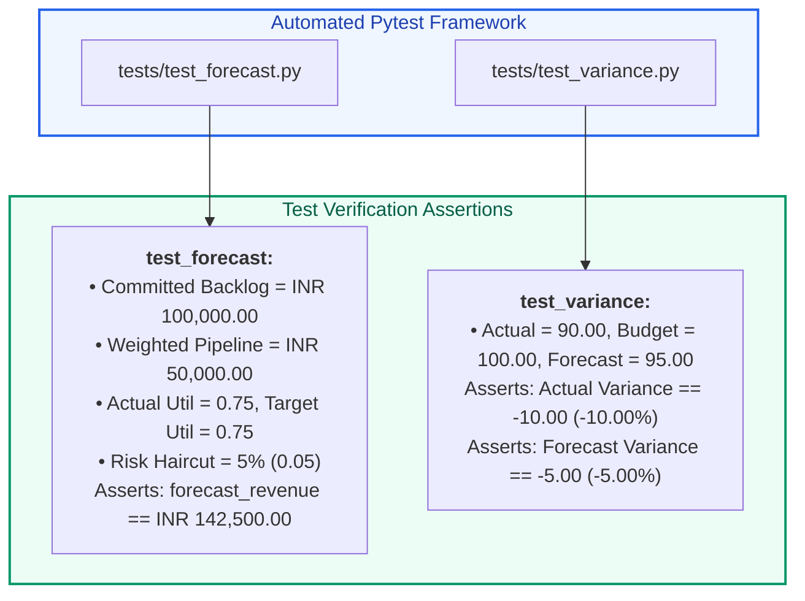

# X-Fin Developer & Operations Manual

> **Technology Stack:** Python 3.10+ · FastAPI · PostgreSQL 14+ / SQLite Fallback · Streamlit · SQLAlchemy · Plotly · Pytest

---

## Local Development Lifecycle



---

## Automated Pytest Suite Specification



### Run Test Suite

```bash
# Run all unit and integration tests with verbose output
python -m pytest tests/ -v
```

---

## Dependency Specification Matrix

| Package Name | Minimum Version | Architectural Role | Layer Categorization |
|:-------------|:---------------:|:-------------------|:---------------------|
| `fastapi` | `0.115.0+` | ASGI Web Framework & Routing | API Gateway |
| `uvicorn` | `0.30.0+` | High-performance ASGI Web Server | Infrastructure |
| `pydantic` | `2.8.0+` | Request / Response Schema Validation | Core Type Safety |
| `sqlalchemy` | `2.0.0+` | Database Connection Pooling & Queries | Data Persistence |
| `psycopg2-binary` | `2.9.9+` | PostgreSQL Database Adapter | Data Persistence |
| `streamlit` | `1.40.0+` | Executive Decision Surface & UI | Presentation |
| `plotly` | `5.24.0+` | Interactive Visualizations & Charts | Presentation |
| `pandas` | `2.2.0+` | Table & Matrix Data Manipulations | Analytics Engine |
| `pytest` | `8.3.0+` | Automated Test Runner & Assertions | Quality Assurance |
| `requests` | `2.32.0+` | Internal HTTP Client for Dashboard | Presentation Client |

---

## Code Quality & Contribution Standards

1. **Pure Python Engines:** All calculation logic in `app/services` must remain pure Python with zero dependencies on FastAPI HTTP request contexts.
2. **Deterministic Reproducibility:** Monte Carlo simulations and stochastic routines must use explicit random seeds (`seed=42`) for testing reproducibility.
3. **Data Quality Awareness:** Never present proxy calculations as authoritative metrics without explicit warning flags.
