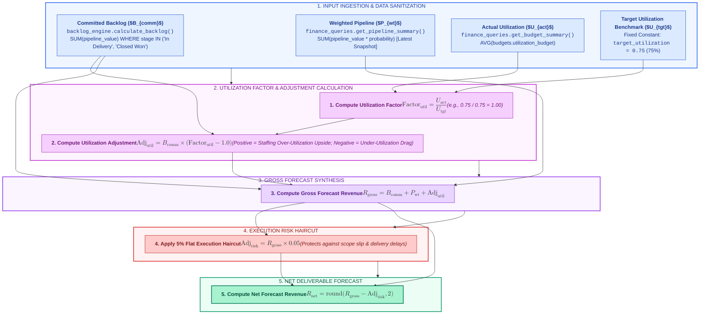
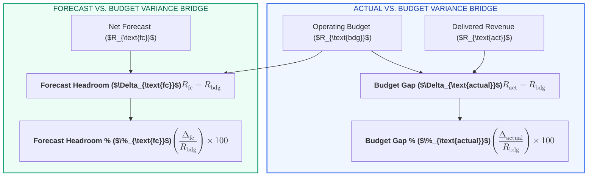

# X-Fin Forecast & Variance Engine Specification

> **Module Paths:** `app/services/forecast_engine.py`, `app/services/forecast_decomposition.py`, `app/services/monte_carlo_engine.py`, `app/services/variance_engine.py`

---

## Forecast Calculation Pipeline

---

## Mathematical Formulation

### 1. Utilization Multiplier & Adjustment

$$\text{Factor}_{\text{util}} = \frac{U_{\text{actual}}}{U_{\text{target}}}$$

$$\text{Adj}_{\text{util}} = \text{Backlog}_{\text{committed}} \times \left( \text{Factor}_{\text{util}} - 1.0 \right)$$

### 2. Gross Forecast Synthesis

$$\text{Gross Forecast} = \text{Backlog}_{\text{committed}} + \text{Pipeline}_{\text{weighted}} + \text{Adj}_{\text{util}}$$

### 3. Execution Risk Haircut

$$\text{Adj}_{\text{risk}} = \text{Gross Forecast} \times 0.05$$

### 4. Net Deliverable Forecast Revenue

$$\text{Forecast Revenue} = \text{Gross Forecast} - \text{Adj}_{\text{risk}}$$

---

## Numerical Step-by-Step Trace Matrix

| Step Number | Calculation Stage | Mathematical Operation | Baseline Numerical Inputs | Computed Output |
|:-----------:|:------------------|:-----------------------|:--------------------------|:----------------|
| **1** | Backlog Ingestion | Extract locked contract value | Sum of In Delivery + Closed Won | **INR 100,000.00** |
| **2** | Pipeline Weighting | $\sum (\text{Value} \times \text{Probability})$ | Sum of active commercial proposals | **INR 50,000.00** |
| **3** | Utilization Delta | $100,000 \times \left(\frac{0.75}{0.75} - 1.0\right)$ | Utilization at target (75.0%) | **INR 0.00** |
| **4** | Gross Synthesis | $100,000 + 50,000 + 0$ | Aggregation of revenue layers | **INR 150,000.00** |
| **5** | Risk Haircut | $150,000 \times 0.05$ | 5% delivery execution haircut | **INR -7,500.00** |
| **6** | **Net Deliverable**| $\mathbf{150,000 - 7,500}$ | **Risk-adjusted period forecast** | **INR 142,500.00** |

---

## Monte Carlo Stochastic Engine Mechanics

`app/services/monte_carlo_engine.py` executes 5,000 stochastic iterations to quantify forecast volatility:

```mermaid
flowchart LR
    subgraph Distributions["1. RANDOM VARIABLE DISTRIBUTIONS"]
        D_PIP["<b>Pipeline Conversion Rate</b><br/>Beta Distribution: $\alpha, \beta$<br/>Centered on historical stage win rates"]
        D_UTL["<b>Staffing Utilization</b><br/>Gaussian Normal Distribution<br/>$\mu = U_{\text{act}}, \sigma = 0.035$"]
        D_SLP["<b>Milestone Delivery Slippage</b><br/>Log-Normal Distribution<br/>Skewed right (0% to 15% slippage)"]
    end

    subgraph Simulation["2. STOCHASTIC SIMULATION ENGINE"]
        S_LOOP["5,000 Independent Trials (Random Seed = 42)<br/>Calculate simulated gross, haircut, and net revenue per trial"]
    end

    subgraph Quantiles["3. STATISTICAL QUANTILES & VaR"]
        Q_P10["<b>P10 (Downside)</b><br/>90% confidence floor"]
        Q_P50["<b>P50 (Median)</b><br/>Stochastic median"]
        Q_P90["<b>P90 (Upside)</b><br/>10% exceedance target"]
        Q_VAR["<b>Value-at-Risk (VaR)</b><br/>$\text{Deterministic} - \text{P10}$"]
    end

    Distributions --> Simulation --> Quantiles

    style Distributions fill:#EFF6FF,stroke:#2563EB,stroke-width:2px,color:#1E40AF
    style Simulation fill:#FAF5FF,stroke:#9333EA,stroke-width:2px,color:#6B21A8
    style Quantiles fill:#ECFDF5,stroke:#059669,stroke-width:2px,color:#065F46
```

### Monte Carlo Distribution Breakdown

| Quantile | Statistical Definition | Meaning for Practice Leadership | Remediation Playbook |
|:---------|:-----------------------|:--------------------------------|:---------------------|
| **P10** | 10th Percentile of outcomes | Stress-tested worst-case deliverable revenue | Set emergency staffing freeze & contractor cuts |
| **P50** | 50th Percentile of outcomes | Probabilistic median expectation | Benchmark against deterministic net forecast |
| **P90** | 90th Percentile of outcomes | Optimistic commercial capture | Pre-allocate recruiting & contractor pipeline |
| **VaR (P10)** | Deterministic Net - P10 | Total downside revenue at risk under market shocks | Monitor top 3 accounts for early warning signs |

---

## Variance Bridge Engine Specification

`app/services/variance_engine.py` components variances between Actual vs. Budget and Forecast vs. Budget:

### Variance Classification Matrix

| Variance Metric | Range Condition | Classification | Management Interpretation |
|:----------------|:----------------|:---------------|:--------------------------|
| **Budget Gap %** | $\ge 0.0\%$ | Ahead of Plan | Practice revenue exceeds budgeted baseline |
| **Budget Gap %** | $-10.0\% \le \text{gap} < 0.0\%$ | Within Tolerance | Minor lag; operational corrective measures required |
| **Budget Gap %** | $< -10.0\%$ | Significant Deficit | Critical delivery shortfall; partner review triggered |
| **Forecast Headroom %** | $\ge 10.0\%$ | Strong Buffer | High probability of beating annual operating plan |
| **Forecast Headroom %** | $0.0\% \le \text{gap} < 10.0\%$ | Moderate Headroom | On-plan; minor vulnerability to deal slippage |
| **Forecast Headroom %** | $< 0.0\%$ | Revenue Deficit | Forward plan insufficient to achieve approved budget |

---

## Input & Output Parameter Specifications

### Input Parameters (`build_forecast`)

| Parameter Name | Python Type | Default | Validation Constraint | Description |
|:---------------|:-----------:|:-------:|:----------------------|:------------|
| `committed_backlog` | `float` | Required | $\ge 0.0$ | Sum of pipeline values for 'In Delivery' and 'Closed Won' |
| `weighted_pipeline` | `float` | Required | $\ge 0.0$ | Sum of $(\text{pipeline\_value} \times \text{win\_probability})$ |
| `utilization` | `float` | `0.74` | $0.0 \le U \le 2.0$ | Current average consultant billable utilization rate |
| `target_utilization` | `float` | `0.75` | $> 0.0$ (Raises `ValueError` if $\le 0$) | Practice benchmark target utilization |
| `risk_rate` | `float` | `0.05` | $0.0 \le \text{rate} \le 1.0$ | Execution risk discount rate |

### Output Dataclass (`ForecastResult`)

| Field Name | Type | Precision | Sample Value | Description |
|:-----------|:----:|:---------:|:-------------|:------------|
| `committed_backlog` | `float` | 2 decimal places | `100000.00` | Input committed backlog volume |
| `weighted_pipeline` | `float` | 2 decimal places | `50000.00` | Input probability-weighted pipeline |
| `utilization_adjustment` | `float` | 2 decimal places | `0.00` | Revenue delta from utilization variance |
| `risk_adjustment` | `float` | 2 decimal places | `7500.00` | 5% execution risk haircut |
| `forecast_revenue` | `float` | 2 decimal places | `142500.00` | **Net risk-adjusted deliverable forecast** |
