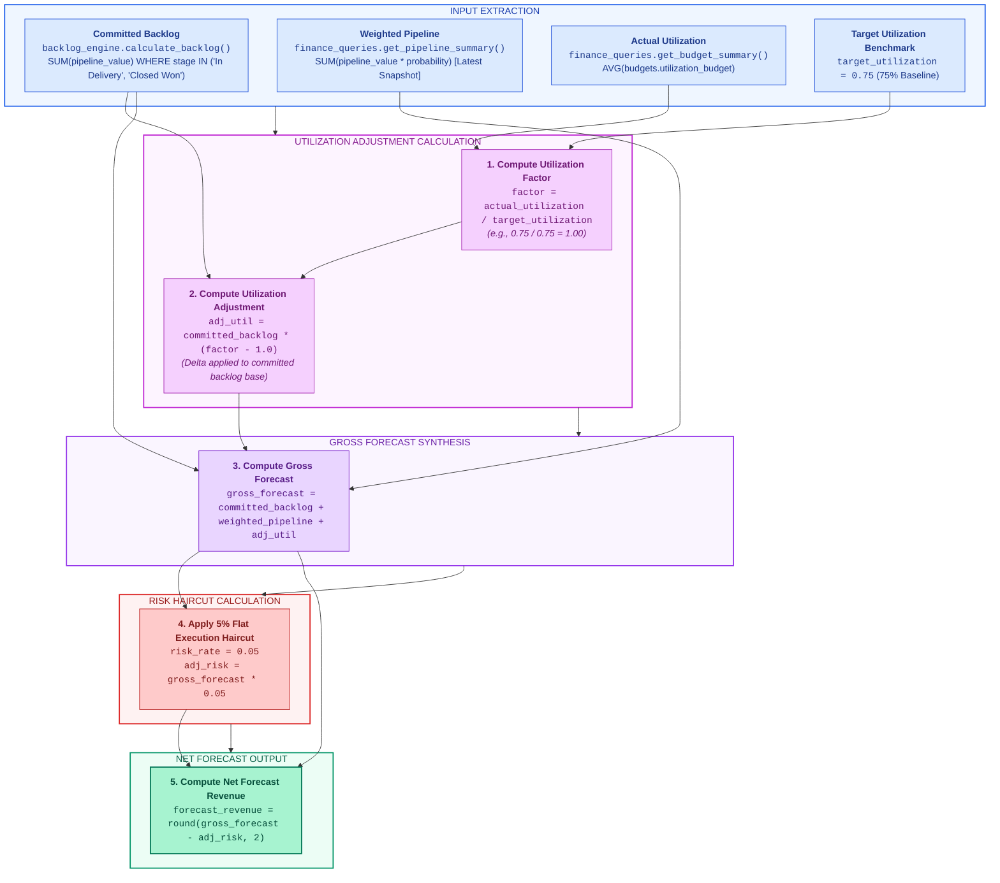
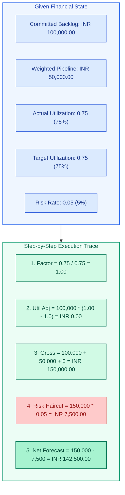
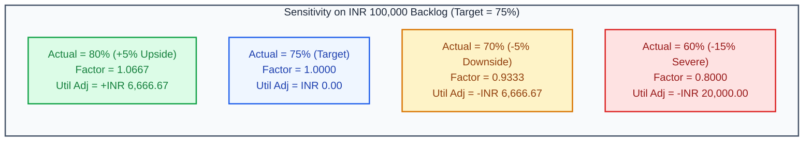
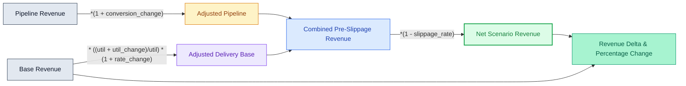

# X-Fin Forecast & Variance Engine Specification

> **Module Path:** `app/services/forecast_engine.py` · **Router:** `app/routers/forecast.py`

---

## Forecast Calculation Pipeline

---

## Mathematical Formulation

$$\text{Factor}_{\text{util}} = \frac{U_{\text{actual}}}{U_{\text{target}}}$$

$$\text{Adj}_{\text{util}} = \text{Backlog}_{\text{committed}} \times \left( \text{Factor}_{\text{util}} - 1.0 \right)$$

$$\text{Gross Forecast} = \text{Backlog}_{\text{committed}} + \text{Pipeline}_{\text{weighted}} + \text{Adj}_{\text{util}}$$

$$\text{Adj}_{\text{risk}} = \text{Gross Forecast} \times 0.05$$

$$\text{Forecast Revenue} = \text{Gross Forecast} - \text{Adj}_{\text{risk}}$$

---

## Input & Output Parameter Specifications

### Input Parameters

| Parameter Name | Python Type | Default Value | Source Query | Description |
|:---------------|:-----------:|:-------------:|:-------------|:------------|
| `committed_backlog` | `float` | Required | `backlog_engine.calculate_backlog()` | Sum of deals in `In Delivery` and `Closed Won` stages |
| `weighted_pipeline` | `float` | Required | `finance_queries.get_pipeline_summary()` | Probability-weighted sum of active pipeline deals |
| `utilization` | `float` | `0.74` | `finance_queries.get_budget_summary()` | Current billable staffing utilization rate |
| `target_utilization` | `float` | `0.75` | Hard-coded Constant | Benchmark target utilization rate (Raises `ValueError` if <= 0) |
| `risk_rate` | `float` | `0.05` | Hard-coded Constant | Standard 5% execution risk discount |

### Output Dataclass (`ForecastResult`)

| Field Name | Type | Precision | Example Value | Description |
|:-----------|:----:|:---------:|:--------------|:------------|
| `committed_backlog` | `float` | 2 decimal places | `100000.00` | Input committed backlog volume |
| `weighted_pipeline` | `float` | 2 decimal places | `50000.00` | Input probability-weighted pipeline |
| `utilization_adjustment` | `float` | 2 decimal places | `0.00` | Revenue adjustment derived from utilization delta |
| `risk_adjustment` | `float` | 2 decimal places | `7500.00` | 5% execution risk haircut |
| `forecast_revenue` | `float` | 2 decimal places | `142500.00` | **Final net deliverable forecast revenue** |

---

## Numerical Trace Verification

> **Automated Verification:** Validated by `pytest tests/test_forecast.py`.

---

## Utilization Sensitivity Model

---

## Variance Engine & Bridge Decomposition

The variance engine (`app/services/variance_engine.py`) provides exact variance calculation and waterfall bridge analysis:

```mermaid
flowchart TD
    subgraph Bridge["Waterfall Variance Bridge Decomposition"]
        B_BUDGET["Budget Revenue Target"]
        V_SLIP["- Project Slippage Delta"]
        V_PIPE["+/- Pipeline Conversion Delta"]
        V_UTIL["+/- Staffing Utilization Delta"]
        V_RATE["+/- Hourly Billing Rate Delta"]
        V_UNEXP["+/- Unexplained Residual Variance"]
        B_ACTUAL["= Final Delivered Actual Revenue"]

        B_BUDGET --> V_SLIP --> V_PIPE --> V_UTIL --> V_RATE --> V_UNEXP --> B_ACTUAL
    end

    style Bridge fill:#F8FAFC,stroke:#334155,stroke-width:2px,color:#0F172A
    style B_BUDGET fill:#DBEAFE,stroke:#1E40AF,stroke-width:2px,color:#1E3A8A
    style V_SLIP fill:#FEE2E2,stroke:#DC2626,stroke-width:1px,color:#991B1B
    style V_PIPE fill:#FEF3C7,stroke:#D97706,stroke-width:1px,color:#92400E
    style V_UTIL fill:#EDE9FE,stroke:#7C3AED,stroke-width:1px,color:#5B21B6
    style V_RATE fill:#EDE9FE,stroke:#7C3AED,stroke-width:1px,color:#5B21B6
    style V_UNEXP fill:#E2E8F0,stroke:#64748B,stroke-width:1px,color:#334155
    style B_ACTUAL fill:#DCFCE7,stroke:#16A34A,stroke-width:2px,color:#15803D
```

### Variance Calculation Formulas (`VarianceResult`)

| Metric Field | Precision | Exact Formula | Functional Description |
|:-------------|:---------:|:--------------|:-----------------------|
| `actual_vs_budget` | `Decimal(2dp)` | `Actual - Budget` | Absolute variance delivered against budget |
| `actual_vs_budget_pct` | `Decimal(2dp)` | `(Actual - Budget) / Budget * 100` | Percentage variance delivered against budget |
| `forecast_vs_budget` | `Decimal(2dp)` | `Forecast - Budget` | Expected variance at period completion |
| `forecast_vs_budget_pct`| `Decimal(2dp)` | `(Forecast - Budget) / Budget * 100` | Projected percentage variance at completion |

---

## Scenario Simulation Logic

`app/services/scenario_engine.py` models revenue sensitivities against delivery and market variables:

