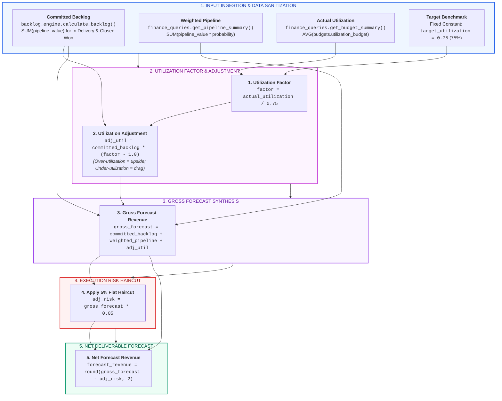
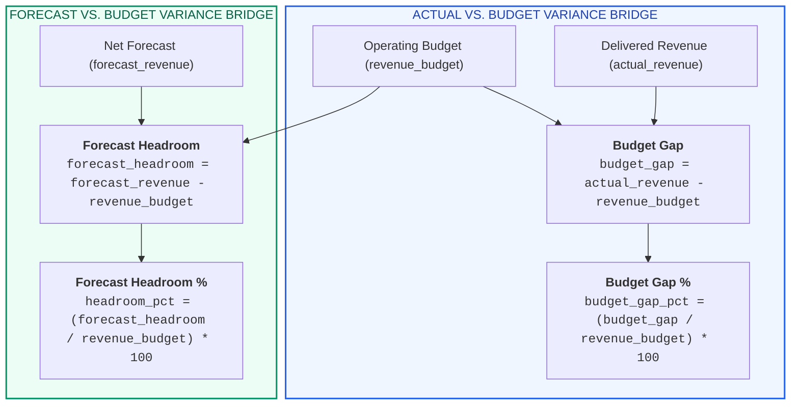

# X-Fin Forecast & Variance Engine Specification

> **Module Paths:** `app/services/forecast_engine.py`, `app/services/forecast_decomposition.py`, `app/services/monte_carlo_engine.py`, `app/services/variance_engine.py`

---

## Forecast Calculation Pipeline



---

## Mathematical Formulation

### 1. Utilization Factor & Adjustment

```text
utilization_factor = actual_utilization / target_utilization

utilization_adjustment = committed_backlog * (utilization_factor - 1.0)
```

### 2. Gross Forecast Synthesis

```text
gross_forecast = committed_backlog + weighted_pipeline + utilization_adjustment
```

### 3. Execution Risk Haircut (5%)

```text
risk_adjustment = gross_forecast * 0.05
```

### 4. Net Deliverable Forecast Revenue

```text
forecast_revenue = round(gross_forecast - risk_adjustment, 2)
```

---

## Numerical Step-by-Step Trace Matrix

| Step Number | Calculation Stage | Mathematical Operation | Baseline Numerical Inputs | Computed Output |
|:-----------:|:------------------|:-----------------------|:--------------------------|:----------------|
| **1** | Backlog Ingestion | Extract locked contract value | Sum of In Delivery + Closed Won | **INR 100,000.00** |
| **2** | Pipeline Weighting | `SUM(value * win_probability)` | Sum of active commercial proposals | **INR 50,000.00** |
| **3** | Utilization Delta | `100,000 * (0.75 / 0.75 - 1.0)` | Utilization at target (75.0%) | **INR 0.00** |
| **4** | Gross Synthesis | `100,000 + 50,000 + 0` | Aggregation of revenue layers | **INR 150,000.00** |
| **5** | Risk Haircut | `150,000 * 0.05` | 5% delivery execution haircut | **INR -7,500.00** |
| **6** | **Net Deliverable**| `150,000 - 7,500` | **Risk-adjusted period forecast** | **INR 142,500.00** |

---

## Monte Carlo Stochastic Engine Mechanics

`app/services/monte_carlo_engine.py` executes 5,000 stochastic iterations to quantify forecast volatility:

```mermaid
flowchart LR
    subgraph Distributions["1. RANDOM DISTRIBUTIONS"]
        D_PIP["<b>Pipeline Win Rate</b><br/>Beta Distribution"]
        D_UTL["<b>Staffing Utilization</b><br/>Normal (mean=0.75, std=0.035)"]
        D_SLP["<b>Delivery Slippage</b><br/>Log-Normal (0% to 15%)"]
    end

    subgraph Simulation["2. STOCHASTIC SIMULATION"]
        S_LOOP["<b>5,000 Iterations (Seed = 42)</b><br/>Calculate gross, haircut & net per trial"]
    end

    subgraph Quantiles["3. QUANTILES & VaR"]
        Q_P10["<b>P10 (Floor)</b>: 90% confidence floor"]
        Q_P50["<b>P50 (Median)</b>: Stochastic median"]
        Q_P90["<b>P90 (Upside)</b>: 10% exceedance target"]
        Q_VAR["<b>VaR</b>: Deterministic Net - P10"]
    end

    Distributions --> Simulation --> Quantiles

    style Distributions fill:#EFF6FF,stroke:#2563EB,stroke-width:2px,color:#1E40AF
    style Simulation fill:#FAF5FF,stroke:#9333EA,stroke-width:2px,color:#6B21A8
    style Quantiles fill:#ECFDF5,stroke:#059669,stroke-width:2px,color:#065F46
```



### Monte Carlo Distribution Breakdown

| Quantile | Statistical Definition | Meaning for Practice Leadership | Remediation Playbook |
|:---------|:-----------------------|:--------------------------------|:---------------------|
| **P10** | 10th Percentile of outcomes | Stress-tested worst-case deliverable revenue | Set emergency staffing freeze & contractor cuts |
| **P50** | 50th Percentile of outcomes | Probabilistic median expectation | Benchmark against deterministic net forecast |
| **P90** | 90th Percentile of outcomes | Optimistic commercial capture | Pre-allocate recruiting & contractor pipeline |
| **VaR (P10)** | `Deterministic Net - P10` | Downside revenue at risk under market shocks | Monitor top 3 accounts for early warning signs |

---

## Variance Bridge Engine Specification

`app/services/variance_engine.py` components variances between Actual vs. Budget and Forecast vs. Budget:



### Variance Classification Matrix

| Variance Metric | Range Condition | Classification | Management Interpretation |
|:----------------|:----------------|:---------------|:--------------------------|
| **Budget Gap %** | `>= 0.0%` | Ahead of Plan | Practice revenue exceeds budgeted baseline |
| **Budget Gap %** | `-10.0% <= gap < 0.0%` | Within Tolerance | Minor lag; operational corrective measures required |
| **Budget Gap %** | `< -10.0%` | Significant Deficit | Critical delivery shortfall; partner review triggered |
| **Forecast Headroom %** | `>= 10.0%` | Strong Buffer | High probability of beating annual operating plan |
| **Forecast Headroom %** | `0.0% <= gap < 10.0%` | Moderate Headroom | On-plan; minor vulnerability to deal slippage |
| **Forecast Headroom %** | `< 0.0%` | Revenue Deficit | Forward plan insufficient to achieve approved budget |

---

## Input & Output Parameter Specifications

### Input Parameters (`build_forecast`)

| Parameter Name | Python Type | Default | Validation Constraint | Description |
|:---------------|:-----------:|:-------:|:----------------------|:------------|
| `committed_backlog` | `float` | Required | `>= 0.0` | Sum of pipeline values for 'In Delivery' and 'Closed Won' |
| `weighted_pipeline` | `float` | Required | `>= 0.0` | Sum of `(pipeline_value * win_probability)` |
| `utilization` | `float` | `0.74` | `0.0 <= U <= 2.0` | Current average consultant billable utilization rate |
| `target_utilization` | `float` | `0.75` | `> 0.0` (Raises `ValueError` if `<= 0`) | Practice benchmark target utilization |
| `risk_rate` | `float` | `0.05` | `0.0 <= rate <= 1.0` | Execution risk discount rate |

### Output Dataclass (`ForecastResult`)

| Field Name | Type | Precision | Sample Value | Description |
|:-----------|:----:|:---------:|:-------------|:------------|
| `committed_backlog` | `float` | 2 decimal places | `100000.00` | Input committed backlog volume |
| `weighted_pipeline` | `float` | 2 decimal places | `50000.00` | Input probability-weighted pipeline |
| `utilization_adjustment` | `float` | 2 decimal places | `0.00` | Revenue delta from utilization variance |
| `risk_adjustment` | `float` | 2 decimal places | `7500.00` | 5% execution risk haircut |
| `forecast_revenue` | `float` | 2 decimal places | `142500.00` | **Net risk-adjusted deliverable forecast** |
