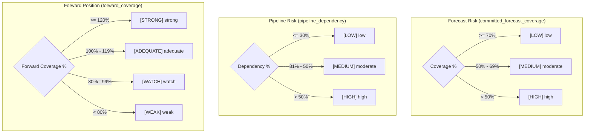

# X-Fin Intelligence Layer Specification

> **Service Modules:** `finance_reasoning.py` · `insight_engine.py` · `recommendation_engine.py`
> **Router:** `app/routers/intelligence.py` · **Endpoint:** `GET /intelligence/overview`

---

## 3-Stage Intelligence Pipeline Architecture

```mermaid
flowchart TD
    subgraph DataInputs["1. FINANCIAL TELEMETRY INGESTION"]
        D1["actual_revenue"]
        D2["budget_revenue"]
        D3["forecast_revenue"]
        D4["committed_backlog"]
        D5["weighted_pipeline"]
    end

    subgraph Stage1["STAGE 1: FINANCE REASONING (finance_reasoning.py)"]
        direction TB
        R_METRICS["<b>Compute 20+ Financial Derived Metrics:</b><br/>• budget_gap = actual_revenue - budget_revenue<br/>• budget_gap_pct = (budget_gap / budget_revenue) * 100<br/>• forecast_gap = forecast_revenue - budget_revenue<br/>• forecast_gap_pct = (forecast_gap / budget_revenue) * 100<br/>• forward_revenue = committed_backlog + weighted_pipeline<br/>• forward_coverage = (forward_revenue / budget_revenue) * 100<br/>• committed_forecast_coverage = (committed_backlog / forecast_revenue) * 100<br/>• pipeline_dependency = (weighted_pipeline / forward_revenue) * 100<br/>• committed_revenue_mix = (committed_backlog / forward_revenue) * 100<br/>• forecast_headroom = forecast_gap<br/>• forecast_headroom_pct = (forecast_headroom / budget_revenue) * 100"]
        R_CLASSIFY["<b>Classify Operational Risk Profiles:</b><br/>• forecast_risk: 'low' (>=70%), 'moderate' (50-69%), 'high' (<50%)<br/>• pipeline_risk: 'low' (<=30%), 'moderate' (31-50%), 'high' (>50%)<br/>• forward_position: 'strong' (>=120%), 'adequate' (100-119%), 'watch' (80-99%), 'weak' (<80%)<br/>• performance: 'ahead_of_plan' (>0), 'below_plan' (<0), 'on_plan' (==0)<br/>• forecast_status: 'on_or_above_plan' (>0), 'below_plan' (<0), 'on_plan' (==0)"]
        R_METRICS --> R_CLASSIFY
    end

    subgraph Stage2["STAGE 2: INSIGHT EVALUATION (insight_engine.py)"]
        direction TB
        I_EVAL["<b>Evaluate 9 Deterministic Severity Rules:</b><br/>1. Actual vs Budget Gap<br/>2. Forecast vs Budget Trajectory<br/>3. Forward Revenue Coverage<br/>4. Committed Forecast Coverage<br/>5. Pipeline Dependency Concentration<br/>6. Committed Revenue Mix Share<br/>7. Forecast Risk Profile<br/>8. Forward Market Position<br/>9. Forecast Headroom Buffer"]
        I_OUT["<b>Array of Scored Insight Objects:</b><br/>severity: 'HIGH' | 'MEDIUM' | 'LOW'<br/>category, metric, message, value"]
        I_EVAL --> I_OUT
    end

    subgraph Stage3["STAGE 3: ACTION RECOMMENDATIONS (recommendation_engine.py)"]
        direction TB
        REC_EVAL["<b>Evaluate 10 Prioritized Action Rules:</b><br/>1. Revenue Recovery Plan<br/>2. Forecast Protection Protocol<br/>3. Pipeline Acceleration Surge<br/>4. Coverage Buffer Maintenance<br/>5. Late-Stage Deal Closing Surge<br/>6. Pipeline Velocity Management<br/>7. Backlog Quality Fortification<br/>8. Backlog Hardening Initiative<br/>9. Portfolio Delivery Audit<br/>10. High-Margin Growth Optimization"]
        REC_OUT["<b>Priority-Sorted Action Items:</b><br/>priority: 'HIGH' | 'MEDIUM' | 'LOW'<br/>category, action, rationale, financial_impact (INR)"]
        REC_EVAL --> REC_OUT
    end

    DataInputs --> Stage1 --> Stage2 --> Stage3
```

---

## Stage 1: Financial Reasoning Metrics Specification

| Metric Identifier | Exact Mathematical Formula | Data Types | Interpretation |
|:------------------|:---------------------------|:----------:|:---------------|
| `budget_gap` | `actual_revenue - budget_revenue` | `float` | Absolute delivered revenue surplus or deficit against budget |
| `budget_gap_pct` | `(budget_gap / budget_revenue) * 100` | `float` | Percentage performance delivered against plan |
| `forecast_gap` | `forecast_revenue - budget_revenue` | `float` | Expected net surplus or deficit at period completion |
| `forecast_gap_pct` | `(forecast_gap / budget_revenue) * 100` | `float` | Expected percentage trajectory vs budget |
| `forward_revenue` | `committed_backlog + weighted_pipeline` | `float` | Total forward addressable revenue volume |
| `forward_coverage`| `(forward_revenue / budget_revenue) * 100` | `float` | Ratio of forward pipeline depth to target budget |
| `committed_forecast_coverage` | `(committed_backlog / forecast_revenue) * 100` | `float` | Percentage of forecast revenue backed by committed contracts |
| `pipeline_dependency` | `(weighted_pipeline / forward_revenue) * 100` | `float` | Proportion of forward revenue contingent on unclosed pipeline |
| `committed_revenue_mix` | `(committed_backlog / forward_revenue) * 100` | `float` | Proportion of forward revenue contractually locked |
| `forecast_headroom` | `forecast_gap` | `float` | Buffer above or below target budget |

---

## Risk Classification Decision Logic

---

## Stage 2: Diagnostic Insights Matrix (9 Rules)

| # | Rule Category | Metric Evaluated | [HIGH] Trigger Condition | [MEDIUM] Trigger Condition | [LOW] Trigger Condition |
|:--:|:--------------|:-----------------|:-------------------------|:---------------------------|:------------------------|
| **1** | Revenue Performance | `budget_gap_pct` | `<= -10.0%` | `-10.0% < gap < 0.0%` | `>= 0.0%` |
| **2** | Forecast Position | `forecast_gap_pct` | `<= -10.0%` | `-10.0% < gap < 0.0%` | `>= 0.0%` |
| **3** | Forward Coverage | `forward_coverage` | `< 100.0%` | `100.0% – 119.9%` | `>= 120.0%` |
| **4** | Forecast Quality | `committed_forecast_coverage` | `< 50.0%` | `50.0% – 69.9%` | `>= 70.0%` |
| **5** | Pipeline Risk | `pipeline_dependency` | `>= 60.0%` | `40.0% – 59.9%` | `< 40.0%` |
| **6** | Revenue Mix | `committed_revenue_mix` | `< 40.0%` | `40.0% – 59.9%` | `>= 60.0%` |
| **7** | Forecast Risk | `forecast_risk` | `=="high"` | `=="moderate"` | `=="low"` |
| **8** | Market Stance | `forward_position` | `in ("watch", "weak")` | `=="adequate"` | `=="strong"` |
| **9** | Headroom Buffer | `forecast_headroom` | `< 0.0` (Deficit) | — | `> 0.0` (Surplus) |

---

## Stage 3: Action Recommendations Matrix (10 Rules)

| Priority | Category | Activation Condition | Triggered Action Item | Financial Impact |
|:---------|:---------|:---------------------|:----------------------|:-----------------|
| **[HIGH]** | Revenue Recovery | `budget_gap < 0` | Deploy aggressive revenue recovery plan to bridge actuals deficit | `abs(budget_gap)` |
| **[HIGH]** | Forecast Protection | `forecast_gap < 0` | Accelerate pipeline conversion and prevent project scope reduction | `abs(forecast_gap)` |
| **[HIGH]** | Pipeline Coverage | `forward_coverage < 100%` | Secure qualified opportunities immediately to meet baseline budget | `budget_revenue - forward_revenue` |
| **[MEDIUM]** | Coverage Protection | `100% <= forward_coverage < 120%` | Maintain active pipeline velocity to preserve forward revenue buffer | `forward_revenue - budget_revenue` |
| **[HIGH]** | Pipeline Risk | `pipeline_dependency >= 60%` | De-risk revenue plan by accelerating contract closure on late-stage deals | `weighted_pipeline` |
| **[MEDIUM]** | Pipeline Management | `40% <= pipeline_dependency < 60%` | Monitor pipeline conversion velocity and track stage progression | `weighted_pipeline` |
| **[HIGH]** | Forecast Quality | `committed_forecast_coverage < 50%` | Increase proportion of committed backlog securing the active forecast | `forecast_revenue - committed_backlog` |
| **[MEDIUM]** | Forecast Quality | `50% <= committed_forecast_coverage < 70%` | Strengthen backlog conversion to bolster forecast certainty | `forecast_revenue - committed_backlog` |
| **[HIGH]** | Forecast Risk | `forecast_risk == "high"` | Conduct immediate portfolio delivery review to reduce delivery variance | `forecast_revenue` |
| **[LOW]** | Growth Optimization | `forward_coverage >= 120%` & `pipeline < 60%` | Leverage strong forward position to target high-margin opportunities | `forecast_gap` |

---

## Note on Terminology & Auditability

> **`committed_forecast_coverage` vs Statistical Confidence**
>
> `committed_forecast_coverage` (and legacy alias `forecast_confidence_base`) measures:
>
> $$\text{Coverage Ratio} = \frac{\text{Committed Backlog}}{\text{Forecast Revenue}} \times 100$$
>
> It is an operational auditability metric reflecting the contractual backing of the forecast revenue figure, not a Gaussian or stochastic probability interval.
