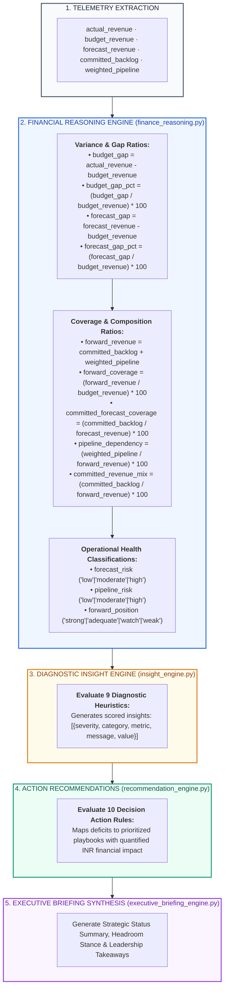
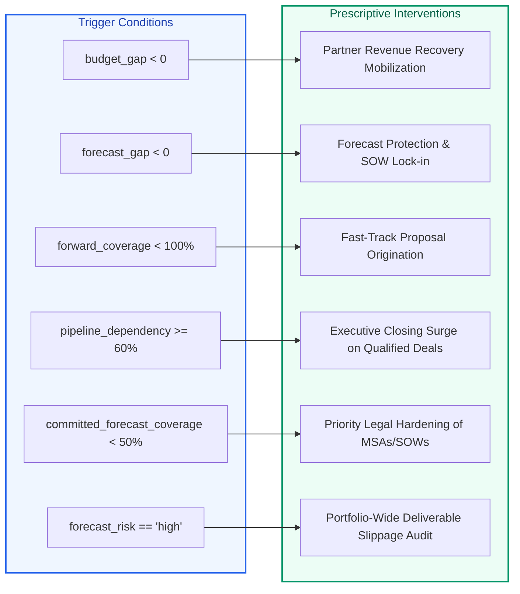
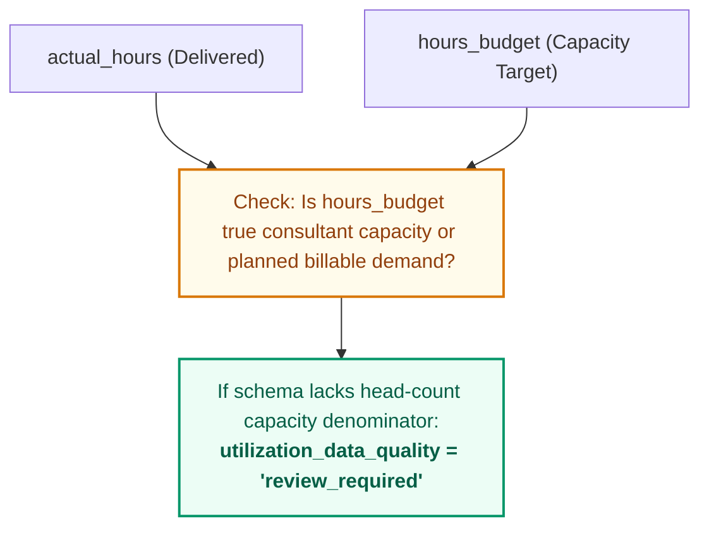

# X-Fin Intelligence & Reasoning Subsystem

> **Module Paths:** `app/services/finance_reasoning.py`, `app/services/insight_engine.py`, `app/services/recommendation_engine.py`, `app/services/intelligence_engine.py`, `app/services/executive_briefing_engine.py`

---

## Intelligence Subsystem Workflow

---

## Complete Financial Reasoning Metric Catalog (20+ Ratios)

| Metric Key | Category | Formula / Definition | Healthy Benchmark | Strategic Operational Meaning |
|:-----------|:---------|:---------------------|:-----------------:|:------------------------------|
| `budget_gap` | Variance | `actual_revenue - budget_revenue` | `>= 0.0` | Recognized fee surplus or deficit vs approved operating budget |
| `budget_gap_pct` | Variance | `(budget_gap / budget_revenue) * 100` | `>= 0.0%` | Relative percentage variance of actual revenue to budget |
| `forecast_gap` | Variance | `forecast_revenue - budget_revenue` | `>= 0.0` | Expected net deliverable surplus or deficit vs target budget |
| `forecast_gap_pct` | Variance | `(forecast_gap / budget_revenue) * 100` | `>= 0.0%` | Relative headroom percentage above approved plan |
| `forecast_headroom` | Forecast | `forecast_revenue - budget_revenue` | `> 0.0` | Absolute buffer above target revenue baseline |
| `forecast_headroom_pct` | Forecast | `(forecast_headroom / budget_revenue) * 100` | `>= 10.0%` | Relative headroom buffer above budget |
| `forward_revenue` | Coverage | `committed_backlog + weighted_pipeline` | `>= budget` | Total forward book of business supporting future revenue |
| `forward_coverage` | Coverage | `(forward_revenue / budget_revenue) * 100` | `>= 120.0%` | Multiple of forward revenue available relative to budget target |
| `committed_forecast_coverage` | Quality | `(committed_backlog / forecast_revenue) * 100` | `>= 70.0%` | Proportion of period forecast secured by executed contracts |
| `committed_revenue_mix` | Quality | `(committed_backlog / forward_revenue) * 100` | `>= 60.0%` | Proportion of total forward book secured by signed SOWs |
| `pipeline_dependency` | Risk | `(weighted_pipeline / forward_revenue) * 100` | `<= 40.0%` | Share of forward book dependent on open proposal wins |
| `forecast_risk` | Classification | Evaluates `committed_forecast_coverage` | `"low"` (`>= 70%`) | Qualitative confidence in forecast delivery attainment |
| `pipeline_risk` | Classification | Evaluates `pipeline_dependency` | `"low"` (`<= 30%`) | Qualitative exposure to commercial pipeline conversion |
| `forward_position` | Classification | Evaluates `forward_coverage` | `"strong"` (`>= 120%`) | Comprehensive market stance and capacity health |
| `performance` | Classification | Evaluates `budget_gap` | `"ahead_of_plan"` (`> 0`) | Current period revenue realization performance |
| `forecast_status` | Classification | Evaluates `forecast_gap` | `"on_or_above_plan"` | Projected year-end delivery target attainment |
| `headroom_status` | Classification | Evaluates `forecast_headroom_pct` | `"strong"` (`>= 10%`) | Practice buffer rating above operating plan |
| `p10_revenue` | Stochastic | Monte Carlo 10th percentile outcome | `~ 0.90 * Net` | Downside revenue floor under adverse market conditions |
| `p50_revenue` | Stochastic | Monte Carlo 50th percentile outcome | `~ Net Forecast` | Median expected probabilistic outcome |
| `p90_revenue` | Stochastic | Monte Carlo 90th percentile outcome | `~ 1.10 * Net` | High-conversion upside revenue potential |
| `var_p10` | Stochastic | `Deterministic Net - P10 Outcome` | Minimize | Downside value-at-risk exposure |

---

## Practice Lead Diagnostic Insights Matrix (9 Rules)

| # | Diagnostic Dimension | Telemetry Metric | [HIGH] Severity Condition | [MEDIUM] Severity Condition | [LOW] Severity Condition | Management Diagnostic Action |
|:--:|:---------------------|:-----------------|:--------------------------|:----------------------------|:-------------------------|:-----------------------------|
| **1** | Revenue Performance | `budget_gap_pct` | `<= -10.0%` | `-10.0% < gap < 0.0%` | `>= 0.0%` | Audit billable hours recognition & scope creep on active cases |
| **2** | Forecast Trajectory | `forecast_gap_pct` | `<= -10.0%` | `-10.0% < gap < 0.0%` | `>= 0.0%` | Mobilize partner commercial bandwidth to accelerate deals |
| **3** | Forward Coverage | `forward_coverage` | `< 100.0%` | `100.0% <= cov < 120.0%` | `>= 120.0%` | Originate new proposals in tier-1 client accounts |
| **4** | Forecast Quality | `committed_forecast_coverage` | `< 50.0%` | `50.0% <= cov < 70.0%` | `>= 70.0%` | Expedite client execution of pending Statements of Work (SOWs) |
| **5** | Pipeline Dependency | `pipeline_dependency` | `>= 60.0%` | `40.0% <= dep < 60.0%` | `< 40.0%` | Mitigate risk by securing firm commitments on top 3 opportunities |
| **6** | Committed Revenue Mix| `committed_revenue_mix` | `< 40.0%` | `40.0% <= mix < 60.0%` | `>= 60.0%` | Convert verbal client confirmations into binding commitments |
| **7** | Forecast Risk Profile| `forecast_risk` | `== "high"` | `== "moderate"` | `== "low"` | Institute weekly milestone health checks with delivery leads |
| **8** | Market Stance | `forward_position` | `in ("watch", "weak")` | `== "adequate"` | `== "strong"` | Align practice hiring and bench models with pipeline demand |
| **9** | Headroom Buffer | `forecast_headroom` | `< 0.0` | — | `> 0.0` | Allocate partner commercial capacity to bridge revenue deficit |

---

## Action Recommendation Engine (10 Rules + Staffing Actions)

### Action Recommendation Catalog & Financial Valuation

| Priority | Strategy Category | Activation Rule | Action Description | Quantified Financial Impact (INR) |
|:---------|:------------------|:----------------|:-------------------|:----------------------------------|
| **[HIGH]** | Revenue Recovery | `budget_gap < 0` | Mobilize partner-led revenue recovery plan on lagging accounts | `abs(budget_gap)` |
| **[HIGH]** | Forecast Protection | `forecast_gap < 0` | Lock in pending contract extensions and prevent scope reduction | `abs(forecast_gap)` |
| **[HIGH]** | Pipeline Coverage | `forward_coverage < 100%` | Fast-track high-probability proposals to achieve baseline budget | `budget - forward_revenue` |
| **[MEDIUM]** | Coverage Buffer | `100% <= forward_coverage < 120%` | Maintain business development momentum to preserve safety buffer | `forward_revenue - budget` |
| **[HIGH]** | Deal Closure Surge | `pipeline_dependency >= 60%` | Conduct executive closing sessions on all deals in Qualified stage | `weighted_pipeline` |
| **[MEDIUM]** | Velocity Management| `40% <= pipeline_dependency < 60%` | Review stage-gate progression weekly with client teams | `weighted_pipeline` |
| **[HIGH]** | Backlog Fortification| `committed_forecast_coverage < 50%`| Prioritize execution of MSAs and SOWs currently under legal review | `forecast - backlog` |
| **[MEDIUM]** | Backlog Hardening | `50% <= committed_forecast_coverage < 70%`| Expedite client sign-offs on milestone deliverables | `forecast - backlog` |
| **[HIGH]** | Delivery Audit | `forecast_risk == "high"` | Conduct portfolio-wide review to prevent deliverable slippage | `forecast_revenue` |
| **[LOW]** | Margin Optimization| `forward_coverage >= 120%` & `pipeline < 60%`| Prioritize higher-margin, premium-rate engagements | `forecast_gap` |

---

## Staffing & Utilization Data-Quality Guardrails

`app/services/staffing_engine.py` and `app/services/staffing_insight_engine.py` evaluate capacity vs hours budget boundaries:

