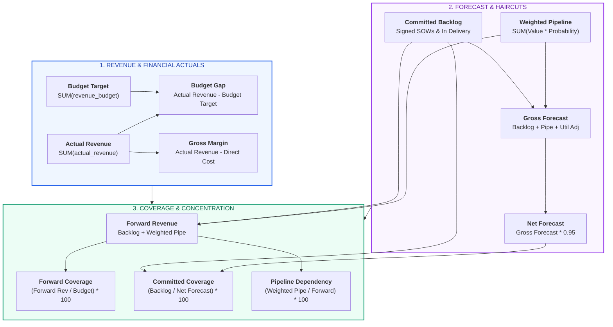

# X-Fin Financial Telemetry & Metrics Specification

> **Audience:** Practice Finance Officers, Engagement Directors, Technical Leads

---

## Financial Metric Taxonomy & Relationships

---

## Master Metric Glossary & Formulas

### 1. Revenue Performance & Engagement Economics

| Metric Name | Formula / Calculation | Units | Healthy Benchmark | Diagnostic Use Case |
|:------------|:----------------------|:-----:|:-----------------:|:--------------------|
| **Actual Revenue** | `SUM(actual_revenue)` | INR | `>= Budget` | Total recognized fee revenue delivered to date |
| **Budget Target** | `SUM(revenue_budget)` | INR | Baseline | Operating plan revenue target approved by leadership |
| **Budget Gap** | `Actual Revenue - Budget Target` | INR | `>= 0.0` | Dollar surplus (positive) or deficit (negative) vs plan |
| **Budget Gap %** | `(Budget Gap / Budget Target) * 100` | `%` | `>= 0.0%` | Normalized performance percentage against plan |
| **Direct Consulting Cost** | `SUM(actual_cost)` | INR | `<= 0.60 * Revenue` | Total direct labor and contractor costs |
| **Gross Margin (INR)** | `Actual Revenue - Direct Cost` | INR | `>= 0.40 * Revenue` | Total practice contribution profit |
| **Gross Margin %** | `(Gross Margin / Actual Revenue) * 100` | `%` | `>= 40.0%` | Practice profitability efficiency |

### 2. Forward Book, Coverage & Quality Ratios

| Metric Name | Formula / Calculation | Units | Healthy Benchmark | Diagnostic Use Case |
|:------------|:----------------------|:-----:|:-----------------:|:--------------------|
| **Committed Backlog** | `SUM(pipeline_value) [In Delivery, Closed Won]` | INR | Maximum | Contractually locked engagement revenue |
| **Weighted Pipeline** | `SUM(pipeline_value * win_probability)` | INR | Secondary | Expected probability value of open proposals |
| **Forward Revenue** | `Committed Backlog + Weighted Pipeline` | INR | `>= Budget` | Total available forward book of business |
| **Forward Coverage**| `(Forward Revenue / Budget) * 100` | `%` | `>= 120.0%` | Forward capacity relative to target budget |
| **Committed Forecast Coverage** | `(Committed Backlog / Net Forecast) * 100` | `%` | `>= 70.0%` | Share of period forecast secured by signed SOWs |
| **Committed Revenue Mix** | `(Committed Backlog / Forward Revenue) * 100` | `%` | `>= 60.0%` | Contract certainty ratio across entire forward book |
| **Pipeline Dependency** | `(Weighted Pipeline / Forward Revenue) * 100` | `%` | `<= 40.0%` | Conversion vulnerability of forward book |
| **Forecast Headroom**| `Net Forecast - Budget Target` | INR | `> 0.0` | Expected dollar cushion above plan |
| **Forecast Headroom %** | `(Forecast Headroom / Budget Target) * 100` | `%` | `>= 10.0%` | Percentage safety buffer above operating budget |

### 3. Stochastic Monte Carlo Metrics

| Metric Name | Statistical Definition | Units | Interpretation & Action |
|:------------|:-----------------------|:-----:|:------------------------|
| **P10 Downside** | 10th percentile outcome of 5,000 runs | INR | 90% confidence floor revenue under negative conversion shocks |
| **P50 Median** | 50th percentile outcome of 5,000 runs | INR | Probabilistic median expectation under simulated volatility |
| **P90 Upside** | 90th percentile outcome of 5,000 runs | INR | Optimistic upside if high-stage proposals close early |
| **Value-at-Risk (VaR)** | `Deterministic Net Forecast - P10 Outcome` | INR | Total quantified revenue exposed to market downside |
| **Probability > Budget** | `(Count(Sim >= Budget) / 5000) * 100` | `%` | Empirical probability of meeting or beating operating budget |

---

## Practice Health Threshold Classification Matrix

| Health Indicator | Green (Healthy) | Amber (Watch) | Red (Critical Action) |
|:-----------------|:----------------|:--------------|:----------------------|
| **Forecast Risk** | `Committed Coverage >= 70%` | `50% <= Coverage < 70%` | `Coverage < 50%` |
| **Pipeline Risk** | `Pipeline Dependency <= 30%` | `30% < Dependency <= 50%` | `Dependency > 50%` |
| **Forward Position**| `Forward Coverage >= 120%` | `100% <= Coverage < 120%` | `Coverage < 100%` |
| **Headroom Status** | `Headroom % >= 10.0%` | `0.0% <= Headroom % < 10.0%` | `Headroom % < 0.0%` |
| **Performance Stance** | `Budget Gap > 0.0` | `Budget Gap == 0.0` | `Budget Gap < 0.0` |

---

## Data Quality & Schema Boundaries

> [!WARNING]
> **Staffing Capacity Denominator Caveat:**
> In the current database schema, `budgets.hours_budget` represents planned billable demand rather than total consultant head-count capacity hours. Therefore, hours attainment (`actual_hours / hours_budget`) is displayed as **Hours vs. Budget Attainment** rather than true utilization. The system sets `data_quality.status = 'review_required'` to maintain leadership transparency.
