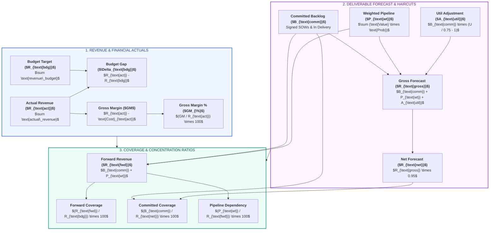

# X-Fin Financial Telemetry & Metrics Specification

> **Audience:** Practice Finance Officers, Engagement Directors, Technical Leads

---

## Financial Metric Taxonomy & Relationships

---

## Master Metric Glossary & Formulas

### 1. Revenue Performance & Engagement Economics

| Metric Name | Mathematical Formula | Units | Healthy Benchmark | Diagnostic Use Case |
|:------------|:---------------------|:-----:|:-----------------:|:--------------------|
| **Actual Revenue** | $\sum \text{actual\_revenue}$ | INR | $\ge \text{Budget}$ | Total recognized fee revenue delivered to date |
| **Budget Target** | $\sum \text{revenue\_budget}$ | INR | Baseline | Operating plan revenue target approved by leadership |
| **Budget Gap** | $\text{Actual} - \text{Budget}$ | INR | $\ge 0.0$ | Dollar surplus (positive) or deficit (negative) vs plan |
| **Budget Gap %** | $(\text{Budget Gap} / \text{Budget}) \times 100$ | $\%$ | $\ge 0.0\%$ | Normalized performance percentage against plan |
| **Direct Consulting Cost** | $\sum \text{actual\_cost}$ | INR | $\le 0.60 \times \text{Rev}$ | Total direct labor and contractor costs |
| **Gross Margin (INR)** | $\text{Actual Revenue} - \text{Direct Cost}$ | INR | $\ge 0.40 \times \text{Rev}$ | Total practice contribution profit |
| **Gross Margin %** | $(\text{Gross Margin} / \text{Actual Revenue}) \times 100$ | $\%$ | $\ge 40.0\%$ | Practice profitability efficiency |

### 2. Forward Book, Coverage & Quality Ratios

| Metric Name | Mathematical Formula | Units | Healthy Benchmark | Diagnostic Use Case |
|:------------|:---------------------|:-----:|:-----------------:|:--------------------|
| **Committed Backlog** | $\sum \text{pipeline\_value} \text{ [In Delivery, Closed Won]}$ | INR | Maximum | Contractually locked engagement revenue |
| **Weighted Pipeline** | $\sum (\text{pipeline\_value} \times \text{win\_probability})$ | INR | Secondary | Expected probability value of open proposals |
| **Forward Revenue** | $\text{Committed Backlog} + \text{Weighted Pipeline}$ | INR | $\ge \text{Budget}$ | Total available forward book of business |
| **Forward Coverage**| $(\text{Forward Revenue} / \text{Budget}) \times 100$ | $\%$ | $\ge 120.0\%$ | Forward capacity relative to target budget |
| **Committed Forecast Coverage** | $(\text{Committed Backlog} / \text{Net Forecast}) \times 100$ | $\%$ | $\ge 70.0\%$ | Share of period forecast secured by signed SOWs |
| **Committed Revenue Mix** | $(\text{Committed Backlog} / \text{Forward Revenue}) \times 100$ | $\%$ | $\ge 60.0\%$ | Contract certainty ratio across entire forward book |
| **Pipeline Dependency** | $(\text{Weighted Pipeline} / \text{Forward Revenue}) \times 100$ | $\%$ | $\le 40.0\%$ | Conversion vulnerability of forward book |
| **Forecast Headroom**| $\text{Net Forecast} - \text{Budget Target}$ | INR | $> 0.0$ | Expected dollar cushion above plan |
| **Forecast Headroom %** | $(\text{Forecast Headroom} / \text{Budget Target}) \times 100$ | $\%$ | $\ge 10.0\%$ | Percentage safety buffer above operating budget |

### 3. Stochastic Monte Carlo Metrics

| Metric Name | Mathematical Definition | Units | Interpretation & Action |
|:------------|:------------------------|:-----:|:------------------------|
| **P10 Downside** | 10th percentile outcome of 5,000 runs | INR | 90% confidence floor revenue under negative conversion shocks |
| **P50 Median** | 50th percentile outcome of 5,000 runs | INR | Probabilistic median expectation under simulated volatility |
| **P90 Upside** | 90th percentile outcome of 5,000 runs | INR | Optimistic upside if high-stage proposals close early |
| **Value-at-Risk (VaR)** | $\text{Deterministic Net Forecast} - \text{P10 Outcome}$ | INR | Total quantified revenue exposed to market downside |
| **Probability > Budget** | $(\text{Count}(\text{Sim} \ge \text{Budget}) / 5000) \times 100$ | $\%$ | Empirical probability of meeting or beating operating budget |

---

## Practice Health Threshold Classification Matrix

| Health Indicator | Green (Healthy) | Amber (Watch) | Red (Critical Action) |
|:-----------------|:----------------|:--------------|:----------------------|
| **Forecast Risk** | $\text{Committed Coverage} \ge 70\%$ | $50\% \le \text{Coverage} < 70\%$ | $\text{Coverage} < 50\%$ |
| **Pipeline Risk** | $\text{Pipeline Dependency} \le 30\%$ | $30\% < \text{Dependency} \le 50\%$ | $\text{Dependency} > 50\%$ |
| **Forward Position**| $\text{Forward Coverage} \ge 120\%$ | $100\% \le \text{Coverage} < 120\%$ | $\text{Coverage} < 100\%$ |
| **Headroom Status** | $\text{Headroom \%} \ge 10.0\%$ | $0.0\% \le \text{Headroom \%} < 10.0\%$ | $\text{Headroom \%} < 0.0\%$ |
| **Performance Stance** | $\text{Budget Gap} > 0.0$ | $\text{Budget Gap} = 0.0$ | $\text{Budget Gap} < 0.0$ |

---

## Data Quality & Schema Boundaries

> [!WARNING]
> **Staffing Capacity Denominator Caveat:**
> In the current database schema, `budgets.hours_budget` represents planned billable demand rather than total consultant head-count capacity hours. Therefore, hours attainment ($\text{actual\_hours} / \text{hours\_budget}$) is displayed as **Hours vs. Budget Attainment** rather than true utilization. The system sets `data_quality.status = 'review_required'` to maintain leadership transparency.
