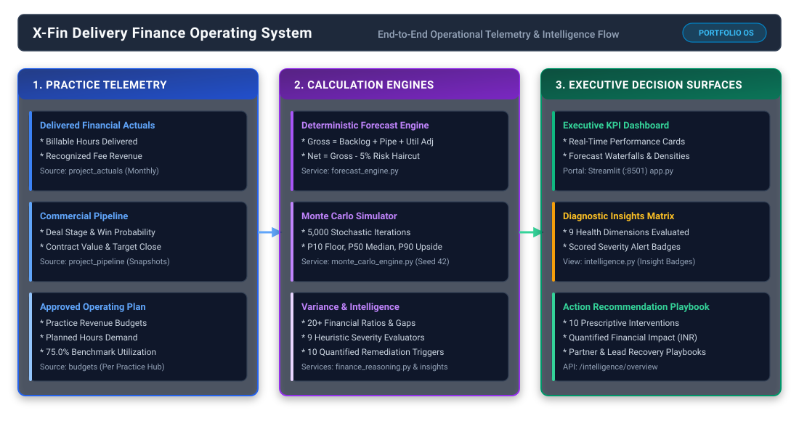
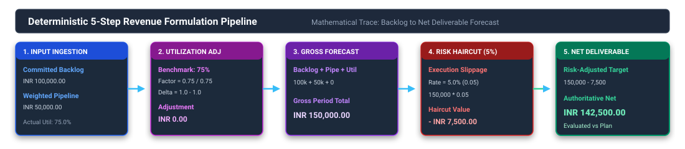
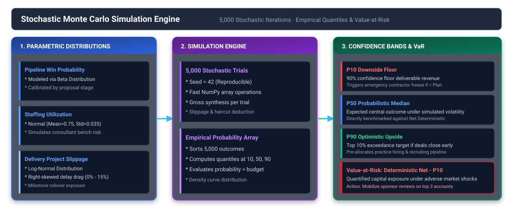
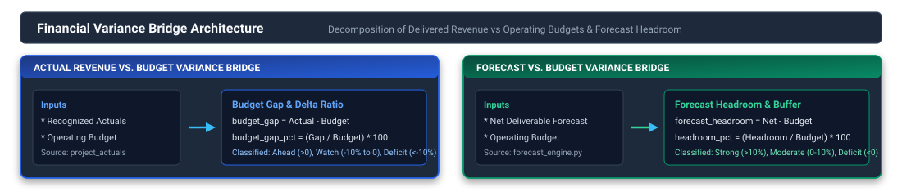
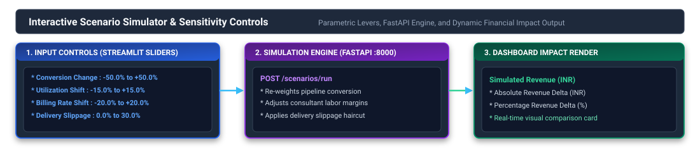
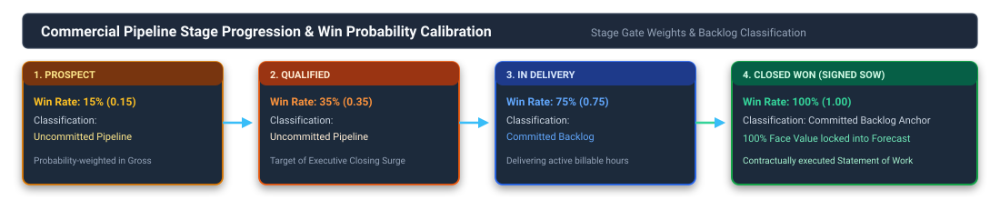

# X-Fin System Reference & Architecture Manual

## Document Overview

This document provides a consolidated technical and operational reference for the **X-Fin Delivery Finance Operating System**. It describes the core architectural layers, computational pipelines, relational data models, REST endpoints, and diagnostic heuristic frameworks.

---

## 1. End-to-End System Architecture

---

## 2. Telemetry Ingestion & Forecast Pipeline

---

## 3. Monte Carlo Simulation Engine

---

## 4. Financial Variance Bridge Architecture

---

## 5. Interactive Scenario Simulator Controls

---

## 6. Commercial Pipeline Progression

---

## 7. Summary Reference Tables

### Core Financial Telemetry Formulas

| Metric Identifier | Mathematical Formula | Target Benchmark | Strategic Purpose |
|:------------------|:---------------------|:----------------:|:------------------|
| **Actual Revenue** | `SUM(project_actuals.actual_revenue)` | `>= Budget Target` | Recognized delivery fees to date |
| **Budget Target** | `SUM(budgets.revenue_budget)` | Operating Baseline | Annual operating plan revenue target |
| **Committed Backlog** | `SUM(pipeline_value) [In Delivery, Closed Won]` | Maximum | Contractually locked engagement value |
| **Weighted Pipeline** | `SUM(pipeline_value * win_probability)` | Conversion Dependent | Probability-weighted open proposal value |
| **Gross Forecast** | `Committed Backlog + Weighted Pipeline + Util Adj` | N/A | Total unadjusted projected revenue |
| **Risk Haircut** | `Gross Forecast * 0.05` | 5.0% Haircut | Execution slippage contingency buffer |
| **Net Forecast** | `Gross Forecast - Risk Haircut` | `>= Budget Target` | Risk-adjusted deliverable forecast |
| **Forecast Headroom** | `Net Forecast - Budget Target` | `> 0.0` | Net buffer above operating target |
| **Forward Coverage** | `((Backlog + Weighted Pipeline) / Budget) * 100` | `>= 120.0%` | Multiple of forward book relative to budget |
| **Pipeline Dependency** | `(Weighted Pipeline / Forward Revenue) * 100` | `<= 40.0%` | Vulnerability of forward plan to deal losses |

### Practice Health Classification Boundaries

| Health Dimension | Healthy (Green) | Watch (Amber) | Critical Action (Red) |
|:-----------------|:---------------:|:-------------:|:---------------------:|
| **Forecast Risk** | Committed Coverage `>= 70%` | `50% <= Coverage < 70%` | Committed Coverage `< 50%` |
| **Pipeline Risk** | Pipeline Dependency `<= 30%` | `30% < Dependency <= 50%` | Pipeline Dependency `> 50%` |
| **Forward Position** | Forward Coverage `>= 120%` | `100% <= Coverage < 120%` | Forward Coverage `< 100%` |
| **Headroom Buffer** | Headroom `% >= 10.0%` | `0.0% <= Headroom % < 10.0%` | Headroom `% < 0.0%` |
| **Revenue Realization**| Budget Gap `>= 0.0` | `-10.0% <= Budget Gap % < 0.0%`| Budget Gap `% < -10.0%` |

---

## 8. Diagnostic & Recommendation Playbook Pipeline

### Diagnostic Insights Matrix (9 Rules)

| # | Diagnostic Dimension | Telemetry Metric Evaluated | High Severity Alert | Medium Severity Alert | Low Severity Alert | Prescribed Diagnostic Action |
|:--:|:---------------------|:--------------------------|:--------------------|:----------------------|:-------------------|:-----------------------------|
| **1** | Revenue Performance | `budget_gap_pct` | `<= -10.0%` | `-10.0% < gap < 0.0%` | `>= 0.0%` | Review delivered billing realization vs plan |
| **2** | Forecast Trajectory | `forecast_gap_pct` | `<= -10.0%` | `-10.0% < gap < 0.0%` | `>= 0.0%` | Assess closing velocity of near-term pipeline |
| **3** | Forward Coverage | `forward_coverage` | `< 100.0%` | `100.0% <= cov < 120.0%` | `>= 120.0%` | Accelerate proposal origination in key accounts |
| **4** | Forecast Quality | `committed_forecast_coverage` | `< 50.0%` | `50.0% <= cov < 70.0%` | `>= 70.0%` | Convert verbal client approvals into executed SOWs |
| **5** | Pipeline Dependency | `pipeline_dependency` | `>= 60.0%` | `40.0% <= dep < 60.0%` | `< 40.0%` | Mitigate risk by securing firm commitments on top 3 deals |
| **6** | Committed Revenue Mix| `committed_revenue_mix` | `< 40.0%` | `40.0% <= mix < 60.0%` | `>= 60.0%` | Harden backlog to protect delivery team staffing |
| **7** | Forecast Risk Profile| `forecast_risk` | `== "high"` | `== "moderate"` | `== "low"` | Implement weekly project milestone health checks |
| **8** | Market Stance | `forward_position` | `in ("watch", "weak")` | `== "adequate"` | `== "strong"` | Align practice staffing models to market demand |
| **9** | Headroom Buffer | `forecast_headroom` | `< 0.0` | N/A | `> 0.0` | Allocate additional commercial capacity to bridge gap |

### Prioritized Action Triggers (10 Remediations with Quantified Financial Impact)

| Priority | Strategy Category | Activation Condition | Prescriptive Operational Intervention | Quantified Impact (INR) |
|:---------|:------------------|:---------------------|:--------------------------------------|:------------------------|
| **[HIGH]** | Revenue Recovery | `budget_gap < 0` | Mobilize partner-led revenue recovery plan on lagging accounts | `abs(budget_gap)` |
| **[HIGH]** | Forecast Protection | `forecast_gap < 0` | Lock in pending contract extensions and prevent scope reduction | `abs(forecast_gap)` |
| **[HIGH]** | Pipeline Coverage | `forward_coverage < 100%` | Fast-track high-probability proposals to achieve baseline budget | `budget - forward_revenue` |
| **[MEDIUM]** | Coverage Buffer | `100% <= forward_coverage < 120%` | Maintain business development momentum to preserve safety buffer | `forward_revenue - budget` |
| **[HIGH]** | Deal Closure Surge | `pipeline_dependency >= 60%` | Conduct executive closing sessions on all deals in Qualified stage | `weighted_pipeline` |
| **[MEDIUM]** | Velocity Management| `40% <= pipeline_dependency < 60%` | Review stage-gate progression weekly with client teams | `weighted_pipeline` |
| **[HIGH]** | Backlog Fortification| `committed_forecast_coverage < 50%` | Prioritize execution of MSAs and SOWs currently under legal review | `forecast - backlog` |
| **[MEDIUM]** | Backlog Hardening | `50% <= committed_forecast_coverage < 70%` | Expedite client sign-offs on milestone deliverables | `forecast - backlog` |
| **[HIGH]** | Delivery Audit | `forecast_risk == "high"` | Conduct portfolio-wide review to prevent deliverable slippage | `forecast_revenue` |
| **[LOW]** | Margin Optimization| `forward_coverage >= 120%` & `pipeline < 60%` | Prioritize higher-margin, premium-rate engagements | `forecast_gap` |
